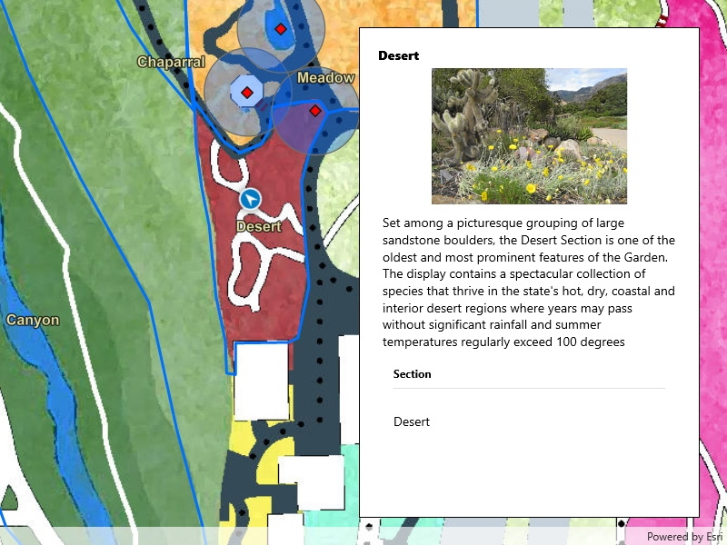

# Set up location-driven Geotriggers

Create a notification every time a given location data source has entered and/or exited a set of features or graphics.

## Use case

Geotriggers can be used to notify users when they have entered or exited a geofence by monitoring a given set of features or graphics. They could be used to display contextual information to museum visitors about nearby exhibits, notify hikers when they have wandered off their desired trail, notify dispatchers when service workers arrive at a scene, or more.

## How to use the sample

Observe a virtual walking tour of the Santa Barbara Botanic Garden. Information about the user's current Garden Section, as well as information about nearby points of interest within 10 meters will display or be removed from the UI when the user enters or exits the buffer of each feature.

## How it works

1. Create a `GeotriggerFeed` with a `LocationDataSource` class (in this case, a `SimulatedLocationDataSource`).
2. Create a `FeatureFenceParameters` class from a `ServiceFeatureTable`, a buffer distance at which to monitor each feature, an Arcade Expression, and a name for the specific geotrigger.
3. Create a `FenceGeotrigger` with the geotrigger feed, a `FenceRuleType`, and the fence parameters.
4. Create a `GeotriggerMonitor` with the fence geotrigger and call `GeotriggerMonitor.StartAsync()` to begin listening for events that meet the `FenceRuleType`.
5. When a `GeotriggerMonitor.Notification` emits, capture the `GeotriggerNotificationInfo`.
6. For more information about the feature that triggered the notification, cast the `GeotriggerNotificationInfo` to a `FenceGeotriggerNotificationInfo` and call `FenceGeotriggerNotificationInfo.`.
7. Depending on the `FenceGeotriggerNotificationInfo.FenceNotificationType` display or hide information on the UI from the `GeoElement`'s attributes.

## Relevant API

* ArcadeExpression
* FeatureFenceParameters
* FenceGeotrigger
* FenceGeotriggerNotificationInfo
* FenceRuleType
* GeoElement
* Geotrigger
* GeotriggerFeed
* GeotriggerMonitor
* GeotriggerNotificationInfo
* ServiceFeatureTable
* SimulatedLocationDataSource

## About the data

This sample uses the [Santa Barbara Botanic Garden Geotriggers Sample](https://arcgisruntime.maps.arcgis.com/home/item.html?id=6ab0e91dc39e478cae4f408e1a36a308) ArcGIS Online Web Map which includes a georeferenced map of the garden as well as select polygon and point features to denote garden sections and points of interest. Description text and attachment images in the feature layers were provided by the Santa Barbara Botanic Garden and more information can be found on the [Explore > Sections](https://sbbotanicgarden.org/explore/sections/) portion of their website. All assets are used with permission from the Santa Barbara Botanic Garden. For more information, visit the [Santa Barbara Botanic Garden](https://sbbotanicgarden.org/) website.

## Tags

alert, arcade, fence, geofence, geotrigger, location, navigation, notification, notify, routing, trigger
