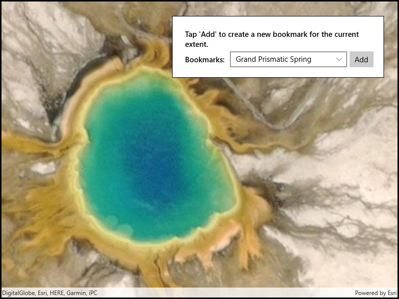

# Manage bookmarks

Access and create bookmarks on a map.

## Use case

Bookmarks are used for easily storing and accessing saved locations on the map. Bookmarks are of interest in educational apps (e.g. touring historical sites) or more specifically, for a land management company wishing to visually monitor flood levels over time at a particular location. These locations can be saved as bookmarks and revisited easily each time their basemap data has been updated (e.g. working with up to date satellite imagery to monitor water levels).

## How to use the sample

The map in the sample comes pre-populated with a set of bookmarks. To access a bookmark and move to that location, click on a bookmark's name from the list. To add a bookmark, pan and/or zoom to a new location and click on the 'Add Bookmark' button. Enter a unique name for the bookmark and click ok, and the bookmark will be added to the list

## How it works

1. Instantiate a new `Map` object and create a `BookmarkList` with `map.Bookmarks`.
2. To create a new bookmark and add it to the bookmark list:
    * Instantiate a new `Bookmark` object passing in text (the name of the bookmark) and a `Viewpoint` as parameters.
    * Add the new bookmark to the book mark list with `BookmarkList.Add(bookmark)`.

## Relevant API

* Bookmark
* BookmarkList
* Viewpoint

## Tags

bookmark, extent, location, zoom