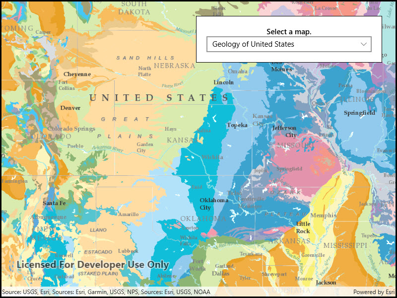

# Open map URL

Display a web map.

## Use case

For displaying web maps stored on ArcGIS Online.

## How to use the sample

A web map can be selected from the drop-down list. On selection the web map displays in the map view.

## How it works

1. Create a `Portal` from the ArcGIS URL http://www.arcgis.com.
2. Create a `PortalItem` using the Portal and the web map ID: `new PortalItem(portal, ID)`.
3. Create a `Map` using the portal item.
4. Set the map to the `MapView`.

## Relevant API

* Map
* MapView
* Portal
* PortalItem

## About the data

The web maps accessed by this sample show [Geology for United States](https://arcgis.com/home/item.html?id=92ad152b9da94dee89b9e387dfe21acd) and [Recent Hurricanes, Cyclones and Typhoons](https://arcgis.com/home/item.html?id=064f2e898b094a17b84e4a4cd5e5f549).

## Tags

portal item, web map
