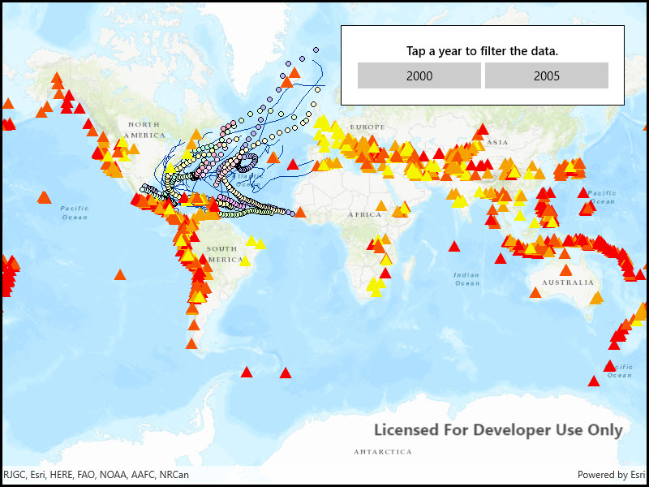

# Change time extent

Filter data in layers by applying a time extent to a MapView.

## Use case

When viewing feature layers that contain a large amount of data with timestamps, you may want to filter the data to only show data relevant to a specific time frame. This can help to visualize changes in the data over time and aids in making better interpretations and predictions of future trends.

## How to use the sample

Switch between the available options and observe how the data is filtered.

## How it works

1. Create a `MapView` with a `Map`, and add layers that have time-enabled data.
2. Set the `TimeExtent` of the map view using `TimeExtent` property of the .

## Relevant API

* Map
* MapView
* TimeExtent

## Additional information

Note that time filtering is not applied until the `MapView` is provided with a `TimeExtent`. If the `TimeExtent` is `null`, no time filtering is applied and all content is rendered.

## Tags

data, filter, time, time frame, time span