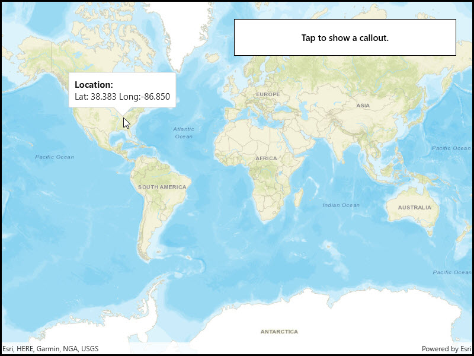

# Show callout

Show a callout with the latitude and longitude of user-tapped points.

## Use case

Callouts are used to display temporary detail content on a map. You can display text and arbitrary UI controls in callouts.

## How to use the sample

Tap anywhere on the map. A callout showing the WGS84 coordinates for the tapped point will appear.

## How it works

1. Listen for `GeoViewTapped` events on the map view.
2. When the user taps, get the tapped location from the `Location` property of the `GeoViewInputEventArgs`.
3. Project the geometry to WGS84 using `GeometryEngine.Project`.
4. Create a string to display the coordinates; note that latitude and longitude in WGS84 map to the Y and X coordinates.
5. Create a new callout definition using a title and the coordinate string.
6. Display the callout by calling `ShowCalloutAt` on the map view with the location and the callout definition.

## Relevant API

* CalloutDefinition
* GeometryEngine.Project
* GeoViewTappedEventArgs
* MapView.GeoViewTapped
* MapView.ShowCalloutAt

## Tags

balloon, bubble, callout, flyout, flyover, info window, popup, tap