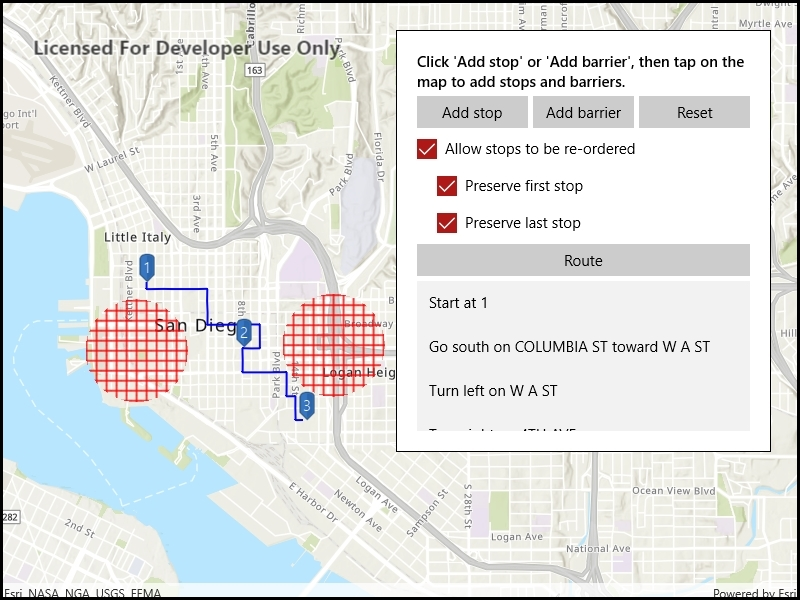

# Route around barriers

Find a route that reaches all stops without crossing any barriers.

## Use case

You can define barriers to avoid unsafe areas, for example flooded roads, when planning the most efficient route to evacuate a hurricane zone. When solving a route, barriers allow you to define portions of the road network that cannot be traversed. You could also use this functionality to plan routes when you know an area will be inaccessible due to a community activity like an organized race or a market night.

In some situations, it is further beneficial to find the most efficient route that reaches all stops, reordering them to reduce travel time. For example, a delivery service may target a number of drop-off addresses, specifically looking to avoid congested areas or closed roads, arranging the stops in the most time-effective order.

## How to use the sample

Click 'Add stop' to add stops to the route. Click 'Add barrier' to add areas that can't be crossed by the route. Click 'Route' to find the route and display it. Select 'Allow stops to be re-ordered' to find the best sequence. Select 'Preserve first stop' if there is a known start point, and 'Preserve last stop' if there is a known final destination.

## How it works

1. Create the route task by calling `RouteTask.CreateAsync(_serviceUrl)` with the URL to a Network Analysis route service.
2. Get the default route parameters for the service by calling `_routeTask.CreateDefaultParametersAsync`.
3. When the user adds a stop, add it to the route parameters.
    1. Normalize the geometry; otherwise the route job would fail if the user included any stops over the 180th degree meridian.
    2. Get the name of the stop by counting the existing stops - `_stepsOverlay.Graphics.Count + 1`.
    3. Create a composite symbol for the stop. This sample uses a pushpin marker and a text symbol.
    4. Create the graphic from the geometry and the symbol.
    5. Add the graphic to the stops graphics overlay.
4. When the user adds a barrier, create a polygon barrier and add it to the route parameters.
    1. Normalize the geometry (see **3i** above).
    2. Buffer the geometry to create a larger barrier from the tapped point by calling `mapLocation.BufferGeodetic(500, LinearUnits.Meters)`.
    3. Create the graphic from the geometry and the symbol.
    4. Add the graphic to the barriers overlay.
5. When ready to find the route, configure the route parameters.
    1. Set the `ReturnStops` and `ReturnDirections` to `true`.
    2. Create a `Stop` for each graphic in the stops graphics overlay. Add that stop to a list, then call `_routeParameters.SetStops(routeStops)`.
    3. Create a `PolygonBarrier` for each graphic in the barriers graphics overlay. Add that barrier to a list, then call `_routeParameters.SetPolygonBarriers(routeBarriers)`.
    4. If the user will accept routes with the stops in any order, set `FindBestSequence` to `true` to find the most optimal route.
    5. If the user has a definite start point, set `PreserveFirstStop` to `true`.
    6. If the user has a definite final destination, set `PreserveLastStop` to `true`.
6. Calculate and display the route.
    1. Call `_routeTask.SolveRouteAsync(_routeParameters)` to get a `RouteResult`.
    2. Get the first returned route by calling `calculatedRoute.Routes.First()`.
    3. Get the geometry from the route as a polyline by accessing the `firstResult.RouteGeometry` property.
    4. Create a graphic from the polyline and a simple line symbol.
    5. Display the steps on the route, available from `firstResult.DirectionManeuvers`.

## Relevant API

* DirectionManeuver
* PolygonBarrier
* Route
* Route.DirectionManeuver
* Route.RouteGeometry
* RouteParameters.ClearPolygonBarriers
* RouteParameters.FindBestSequence
* RouteParameters.PreserveFirstStop
* RouteParameters.PreserveLastStop
* RouteParameters.ReturnDirections
* RouteParameters.ReturnStops
* RouteParameters.SetPolygonBarriers
* RouteResult
* RouteResult.Routes
* RouteTask
* Stop
* Stop.Name

## About the data

This sample uses an Esri-hosted sample street network for San Diego.

## Tags

barriers, best sequence, directions, maneuver, network analysis, routing, sequence, stop order, stops