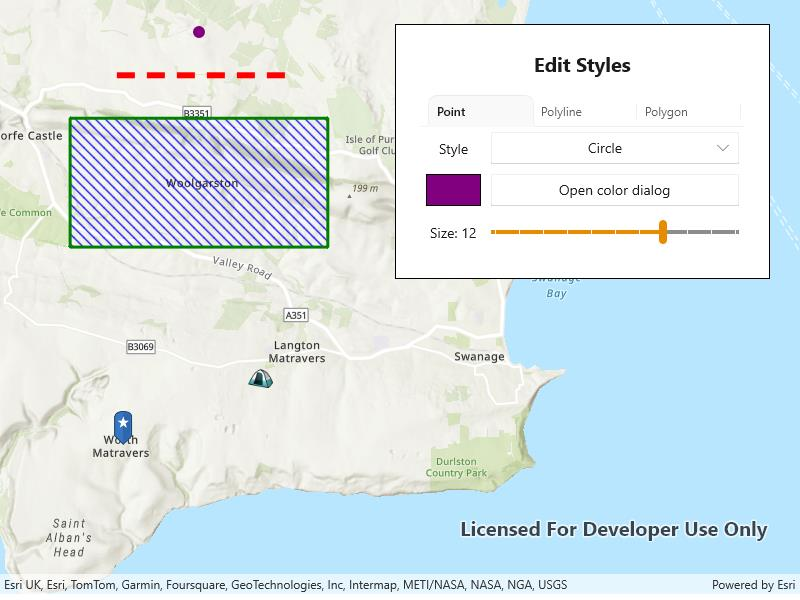

# Style geometry types with symbols

Use a symbol to display a geometry on a map.

## Use case

Customize the appearance of a geometry type with a symbol style suitable for the data. For example, a tourism office may use pictures of landmarks as symbols on an online map or app to help prospective visitors orient themselves more easily around a city. A point on the map styled with a circle could represent a drilled borehole location, whereas a cross could represent the location of an old coal mine shaft. A red line with a dashed style could represent a geological fault mapped on a geological map. A polygon with a brown 'forward-diagonal' fill style could represent an area of artificial ground mapped on a geological map.

## How to use the sample

Tap "Edit Styles" and select a geometry to edit with the picker. Use the controls to change the symbol properties for the geometry.

## How it works

1. Create a `PictureMarkerSymbol` or `SimpleMarkerSymbol` to style a `Point`.
    * For the picture marker symbol, create it using a URL or image and set its height property.
    * For the simple marker symbol, set the `Style`, `Color`, and `Size` properties.
2. Create a `SimpleLineSymbol` to style a `Polyline`.
    * Set the `Style`, `Color`, and `Size` properties.
3. Create a `SimpleFillSymbol` to style a `Polygon`.
    * Set the `Style`, `Color`, and `Outline` properties.
4. Create `Graphic`s using the geometries and symbols and add them to a `GraphicsOverlay`.
5. Add the graphics overlay to a `MapView`.

## Relevant API

* Geometry
* Graphic
* GraphicsOverlay
* PictureMarkerSymbol
* SimpleFillSymbol
* SimpleLineSymbol
* SimpleMarkerSymbol

## Tags

display, fill, graphics, line, marker, overlay, picture, point, symbol, visualization
