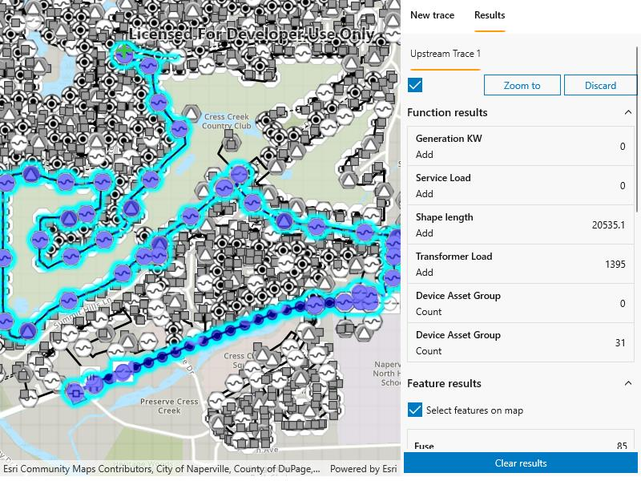

# Trace utility network

Discover connected features in a utility network using connected, subnetwork, upstream, and downstream traces.

## Use case

You can use a trace to visualize and validate the network topology of a utility network for quality assurance. Subnetwork traces are used for validating whether subnetworks, such as circuits or zones, are defined or edited appropriately.

## How to use the sample

Select a trace configuration from the menu. Tap on features after pressing 'Add starting point' button. Delete unwanted starting points by pressing the corresponding trash icon. Press 'Run trace' to initiate a trace on the network. View the results, then 'Clear results' to start over.

## How it works

1. Authenticate the public credentials.
2. Create a `MapView`.
3. Create a `UtilityNetworkTraceTool` and set its `GeoView` to the `MapView`.

## Relevant API

* FractionAlong
* ServiceGeodatabase
* UtilityAssetType
* UtilityDomainNetwork
* UtilityElement
* UtilityElementTraceResult
* UtilityNetwork
* UtilityNetworkDefinition
* UtilityNetworkSource
* UtilityTerminal
* UtilityTier
* UtilityTraceConfiguration
* UtilityTraceParameters
* UtilityTraceResult
* UtilityTraceType
* UtilityTraversability

## About the data

The [Naperville electrical](https://sampleserver7.arcgisonline.com/server/rest/services/UtilityNetwork/NapervilleElectric/FeatureServer) network feature service contains a utility network used to run the subnetwork-based trace shown in this sample. Authentication is required and handled within the sample code.

## Additional information

Using utility network on ArcGIS Enterprise 10.8 requires an ArcGIS Enterprise member account licensed with the [Utility Network user type extension](https://enterprise.arcgis.com/en/portal/latest/administer/windows/license-user-type-extensions.htm#ESRI_SECTION1_41D78AD9691B42E0A8C227C113C0C0BF). Please refer to the [utility network services documentation](https://enterprise.arcgis.com/en/server/latest/publish-services/windows/utility-network-services.htm).

## Tags

condition barriers, downstream trace, network analysis, subnetwork trace, trace configuration, traversability, upstream trace, utility network, validate consistency
