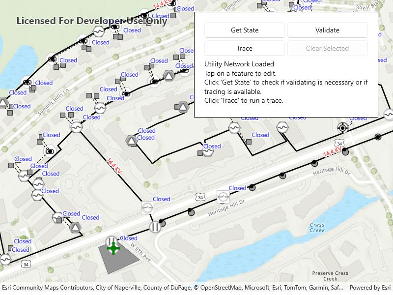

# Validate utility network topology

Demonstrates the workflow of getting the network state and validating the topology of a utility network.

## Use case

Dirty areas are generated where edits to utility network features have not been evaluated against the network rules. Tracing across this area could result in an error or return inaccurate results. Validating the utility network updates the network topology with the edited feature data, maintaining consistency between the features and topology. Querying the network state allows you to determine if there are dirty areas or errors in a utility network, and if it supports network topology.

## How to use the sample

Select features to make edits and then use 'Update and Apply Edit' to send edits to the server.

* Click 'Get state' to check if validate is required or if tracing is available.
* Click 'Validate' to validate network topology and clear dirty areas.
* Click 'Trace' to run a trace.

## How it works

1. Create and load a `Map` with a web map item URL.
2. Load the `UtilityNetwork` from the web map and switch its `ServiceGeodatabase` to a new branch version.
3. Add `LabelDefinition`s for the fields that will be updated on a feature edit.
4. Add the `UtilityNetwork.DirtyAreaTable` to the map to visualize dirty areas or errors.
5. Set a default starting location and trace parameters to stop traversability on an open device.
6. Get the `UtilityNetworkCapabilities` from the `UtilityNetworkDefinition` and use these values to enable or disable the 'Get State', 'Validate', and 'Trace' buttons.
7. When an `ArcGISFeature` is selected for editing, populate the choice list for the field value using the field's `CodedValueDomain.CodedValues`.
8. When 'Update and Apply Edits' is clicked, update the value of the selected feature's attribute value with the selected `CodedValue.Code` and call `ServiceGeodatabase.ApplyEditsAsync()`.
9. When 'Get State' is clicked, call `UtilityNetwork.GetStateAsync()` and print the results.
10. When 'Validate' is clicked, get the current map extent and call `UtilityNetwork.ValidateNetworkTopology()`.
11. When 'Trace' is clicked, call `UtilityNetwork.TraceAsync()` with the predefined parameters and select all features returned.
12. When 'Clear Selection' or 'Cancel' are clicked, clear all selected features on each layer in the map and close the attribute picker.

## Relevant API

* UtilityElement
* UtilityElementTraceResult
* UtilityNetwork
* UtilityNetworkCapabilities
* UtilityNetworkState
* UtilityNetworkValidationJob
* UtilityTraceConfiguration
* UtilityTraceParameters
* UtilityTraceResult

## About the data

The [Naperville electric](https://sampleserver7.arcgisonline.com/server/rest/services/UtilityNetwork/NapervilleElectricV5/FeatureServer) feature service contains a utility network that can be used to query the network state and validate network topology before tracing. The [Naperville electric webmap](https://sampleserver7.arcgisonline.com/portal/home/item.html?id=6e3fc6db3d0b4e6589eb4097eb3e5b9b) uses the same feature service endpoint and is shown in this sample. Authentication is required and handled within the sample code.

## Tags

dirty areas, edit, network topology, online, state, trace, utility network, validate
