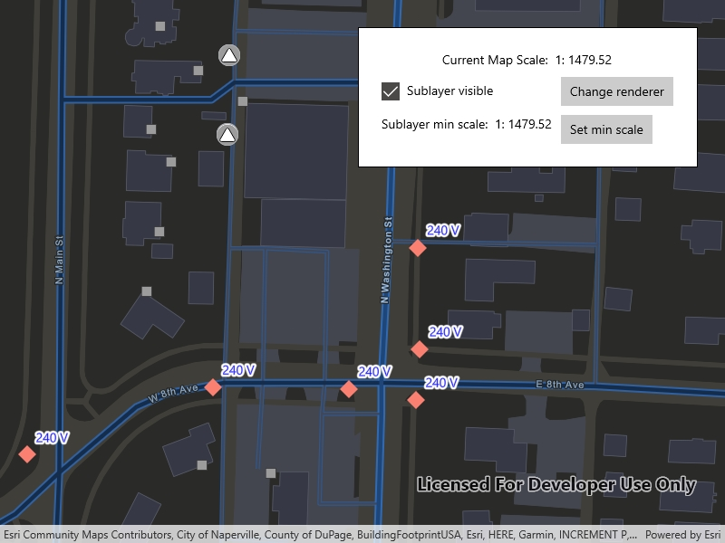

# Display subtype feature layer

Displays a composite layer of all the subtype values in a feature class.

## Use case

This is useful for controlling labeling, visibility, and symbology of a given subtype as though they are distinct layers on the map.

## How to use the sample

The sample loads with the sublayer visible on the map. Change the sublayer's visibiliy, renderer, and minimum scale using the on screen controls. Setting the minimum scale will change its value to that of the current map scale. Zoom in and out to see the sublayer become visible based on its new scale range.

## How it works

1. Create a `SubtypeFeatureLayer` from a `ServiceFeatureTable` that defines a subtype, and add it to the `Map`.
2. Get a `SubtypeSublayer` from the subtype feature using its name.
3. Enable the sublayer's labels and define them with a `LabelDefinition`.
4. Set the visibility status using this sublayer's `IsVisible` property.
5. Change the sublayer's symbology using this sublayer's `Renderer` property.
6. Update the sublayer's minimum scale value using the using the mapview's current scale.

## Relevant API

* LabelDefinition
* ServiceFeatureTable
* SimpleLabelExpression
* SubtypeFeatureLayer
* SubtypeSublayer

## About the data

The [feature service layer](https://sampleserver7.arcgisonline.com/server/rest/services/UtilityNetwork/NapervilleElectric/FeatureServer/0) in this sample represents an electric network in Naperville, Illinois, which contains a utility network with asset classification for different devices.

## Additional information

Using utility network on ArcGIS Enterprise 10.8 requires an ArcGIS Enterprise member account licensed with the [Utility Network user type extension](https://enterprise.arcgis.com/en/portal/latest/administer/windows/license-user-type-extensions.htm#ESRI_SECTION1_41D78AD9691B42E0A8C227C113C0C0BF). Please refer to the [utility network services documentation](https://enterprise.arcgis.com/en/server/latest/publish-services/windows/utility-network-services.htm).

## Tags

asset group, feature layer, labeling, sublayer, subtype, symbology, utility network, visible scale range
