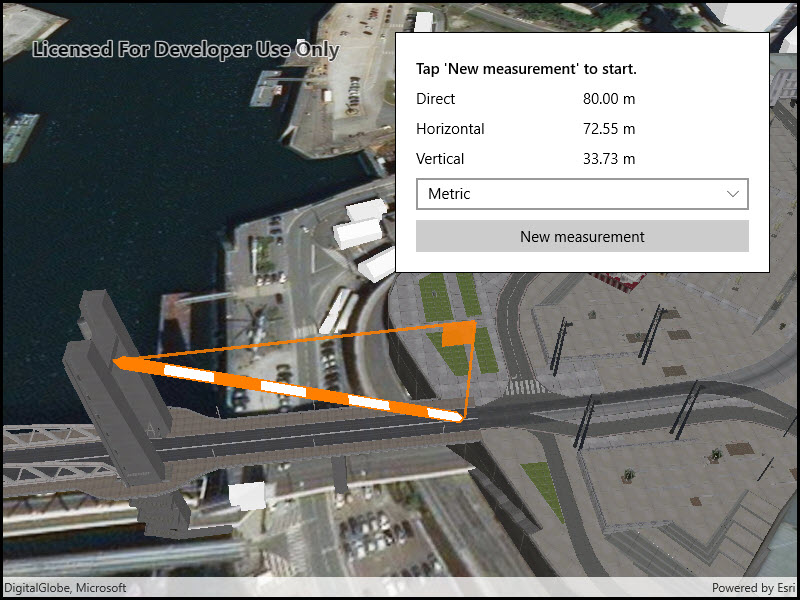

# Distance measurement analysis

Measure distances between two points in 3D.

## Use case

The distance measurement analysis allows you to add to your app the same interactive measuring experience found in ArcGIS Pro, City Engine, and the ArcGIS API for JavaScript. You can set the unit system of measurement (metric or imperial). The units automatically switch to one appropriate for the current scale.

## How to use the sample

Choose a unit system for the measurement. Click any location in the scene to start measuring. Move the mouse to an end location, and click to complete the measurement. Click a new location to clear and start a new measurement.

## How it works

1. Create an `AnalysisOverlay` object and add it to the analysis overlay collection of the `SceneView` object.
2. Specify the start location and end location to create a `LocationDistanceMeasurement` object. Initially, the start and end locations can be the same point.
3. Add the location distance measurement analysis to the analysis overlay.
4. The `MeasurementChanged` event will be raised if the distances change. You can get the new values for the `DirectDistance`, `HorizontalDistance`, and `VerticalDistance` from the event arguments.

## Relevant API

* AnalysisOverlay
* LocationDistanceMeasurement
* LocationDistanceMeasurement.MeasurementChanged

## Additional information

The `LocationDistanceMeasurement` analysis only performs planar distance calculations. This may not be appropriate for large distances where the Earth's curvature must be considered.

## Tags

3D, analysis, distance, measure