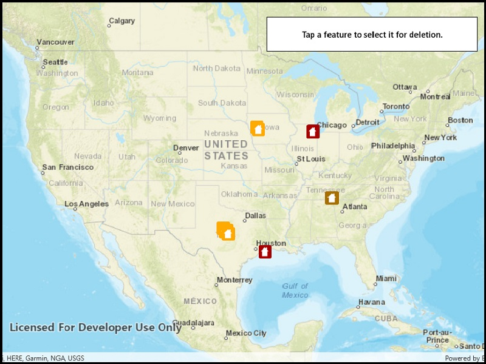

# Delete features (feature service)

Delete features from an online feature service.

## Use case

Sometimes users may want to delete features from an online feature service.

## How to use the sample

To delete a feature, tap it, then click 'Delete incident'.

## How it works

1. Create a `ServiceGeodatabase` object from a URL.
2. Get a `ServiceFeatureTable` object from the `ServiceGeodatabase` object.
3. Create a `FeatureLayer` object from the service feature table.
4. Select features from the feature layer via `FeatureLayer.SelectFeatures()`.
5. Remove the selected features from the service feature table using `ServiceFeatureTable.DeleteFeatureAsync()`.
6. Update the table on the server using `ServiceFeatureTable.ServiceGeodatabase.ApplyEditsAsync()`.

## Relevant API

* Feature
* FeatureLayer
* ServiceFeatureTable
* ServiceGeodatabase

## Tags

deletion, feature, online, Service, table