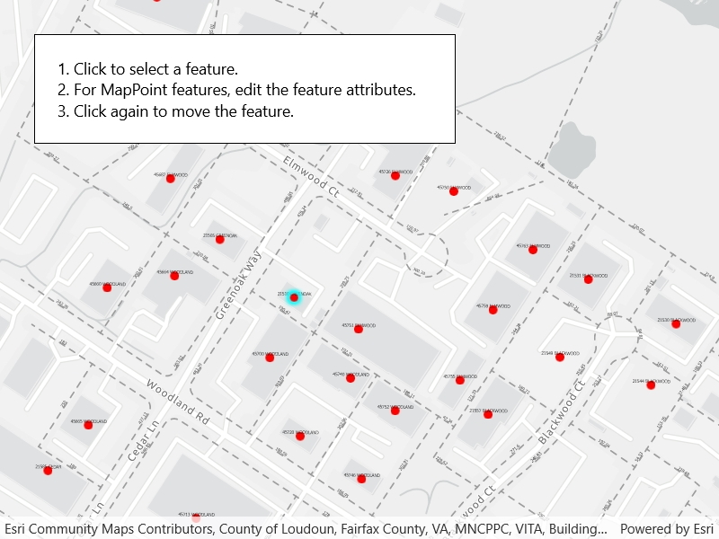

# Edit features with feature-linked annotation

Edit feature attributes which are linked to annotation through an expression.

## Use case

Annotation is useful for displaying text that you don't want to move or resize when the map is panned or zoomed (unlike labels which will move and resize). Feature-linked annotation will update when a feature attribute referenced by the annotation expression is also updated. Additionally, the position of the annotation will transform to match any transformation to the linked feature's geometry.

## How to use the sample

Pan and zoom the map to see that the text on the map is annotation, not labels. Click one of the address points to update the house number (AD_ADDRESS) and street name (ST_STR_NAM). Click one of the dashed parcel polylines and click another location to change its geometry. NOTE: Selection is only enabled for points and straight (single segment) polylines.

The feature-linked annotation will update accordingly.

## How it works

1. Load the geodatabase. NOTE: Read/write geodatabases should normally come from a `GeodatabaseSyncTask`, but this has been omitted here. That functionality is covered in the sample *Generate geodatabase*.
2. Create `FeatureLayer`s from geodatabase feature tables found in the geodatabase with `geodatabase.GeodatabaseFeatureTable`.
3. Create `AnnotationLayer`s from geodatabase feature tables found in the geodatabase with `geodatabase.GeodatabaseAnnotationTable`.
4. Add the `FeatureLayer`s and `AnnotationLayer`s to the map's operational layers.
5. Use a `GeoViewTapped` event handler to listen for clicks on the map to either select address points or parcel polyline features.  NOTE: Selection is only enabled for points and straight (single segment) polylines.
    * For the address points, a dialog is opened to allow editing of the address number (AD_ADDRESS) and street name (ST_STR_NAM) attributes.
    * For the parcel lines, a second tap will change one of the polyline's vertices.

Both expressions were defined by the data author in ArcGIS Pro using [the Arcade expression language](https://developers.arcgis.com/arcade/).

## Relevant API

* AnnotationLayer
* Feature
* FeatureLayer
* Geodatabase

## Offline data

This sample downloads the following items from ArcGIS Online automatically:

* [loudoun_anno geodatabase](https://www.arcgis.com/home/item.html?id=74c0c9fa80f4498c9739cc42531e9948)

## About the data

This sample uses data derived from the [Loudoun GeoHub](https://geohub-loudoungis.opendata.arcgis.com/).

The annotation linked to the point data in this sample is defined by arcade expression `$feature.AD_ADDRESS + " " + $feature.ST_STR_NAM`. The annotation linked to the parcel polyline data is defined by `Round(Length(Geometry($feature), 'feet'), 2)`.

## Tags

annotation, attributes, feature-linked annotation, features, fields
