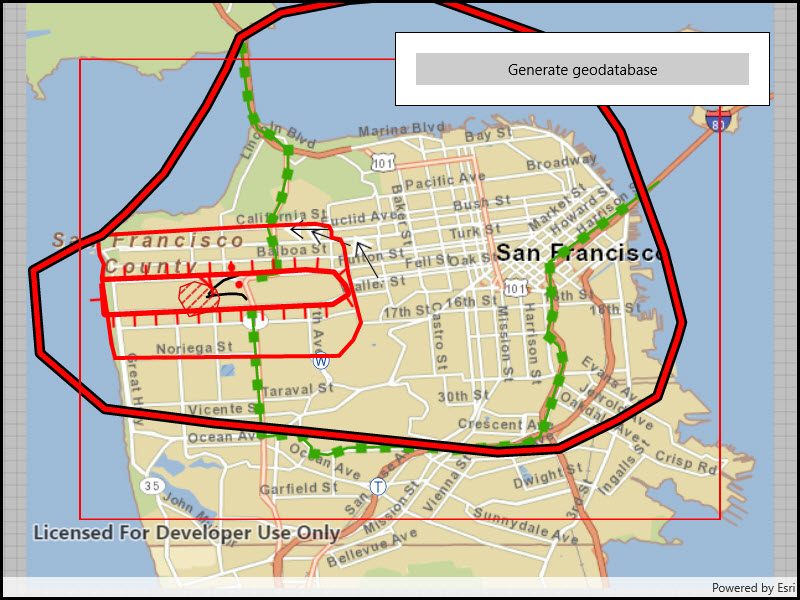

# Generate geodatabase replica from feature service

Generate a local geodatabase from an online feature service.

## Use case

Generating geodatabases is the first step toward taking a feature service offline. It allows you to save features locally for offline display.

## How to use the sample

Zoom to any extent. Then click the generate button to generate a geodatabase of features from a feature service filtered to the current extent. A red outline will show the extent used. The job's progress is shown while the geodatabase is generated.

## How it works

1. Create a `GeodatabaseSyncTask` with the URL of the feature service and load it.
2. Create `GenerateGeodatabaseReplicaParameters` specifying the extent and whether to include attachments.
3. Create a `GenerateGeodatabaseReplicaJob` with `geodatabaseSyncTask.GenerateGeodatabaseReplicaAsync(parameters, downloadPath)`. Start the job with `job.Start()`.
4. When the job is done, `job.GetResultAsync()` will return the geodatabase. Inside the geodatabase are feature tables which can be used to add feature layers to the map.
5. Call `syncTask.UnregisterGeodatabaseAsync(geodatabase)` after generation when you're not planning on syncing changes to the service.

## Relevant API

* GenerateGeodatabaseReplicaJob
* GenerateGeodatabaseReplicaParameters
* Geodatabase
* GeodatabaseSyncTask

## Tags

disconnected, local geodatabase, offline, replica, sync
