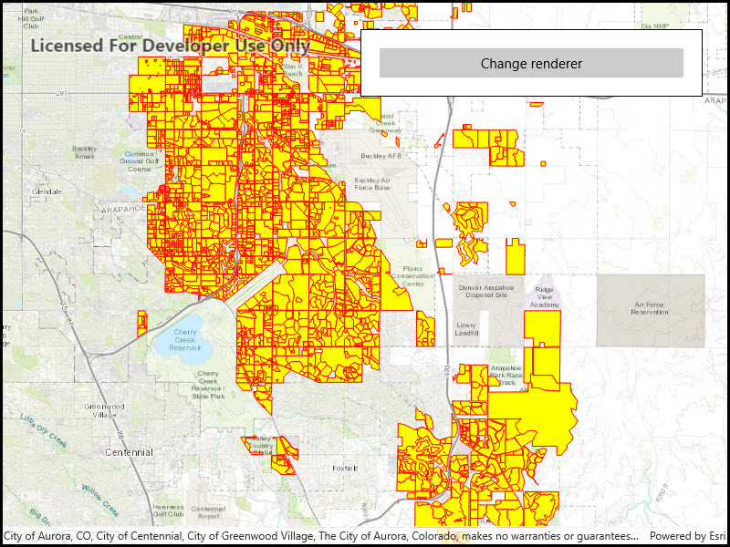

# Symbolize shapefile

Display a shapefile with custom symbology.

## Use case

Feature layers created from shapefiles do not possess any rendering information, and will be assigned with a default symbology. You can apply custom styling to ensure that the content is visible and usable in the context of a specific map. For example, you could use this to visually differentiate between features originating from two different shapefiles, by applying a blue color to one, and a red color to the other.

## How to use the sample

Click the button to apply a new symbology renderer to the feature layer created from the shapefile. 

## How it works

1. Create a `ShapefileFeatureTable`, providing the path to a shapefile.
2. Create a `FeatureLayer` and associate it with the `ShapeFileFeatureTable`.
3. Create a `SimpleRenderer` to override the default symbology. The simple renderer takes a symbol and applies that to all features in a layer.
4. Apply the renderer to the `FeatureLayer` by setting the renderer.

## Relevant API

* FeatureLayer
* ShapefileFeatureTable
* SimpleFillSymbol
* SimpleLineSymbol
* SimpleRenderer

## Offline data

This sample downloads the following items from ArcGIS Online automatically:

* [Aurora_CO_shp.zip](https://www.arcgis.com/home/item.html?id=d98b3e5293834c5f852f13c569930caa) - Shapefiles that cover Aurora Colorado: Public art (points), Bike trails (lines), and Subdivisions (polygons).

## About the data

This sample displays a shapefile containing subdivisions in Aurora, CO.

## Additional information

While shapefiles contain no rendering information, other data sources such as Service Feature Tables or Geodatabase Feature Tables can contain such information. As a result, the rendering properties of the other data sources can be pre-defined by the author.

## Tags

package, shape file, shapefile, symbology, visualization