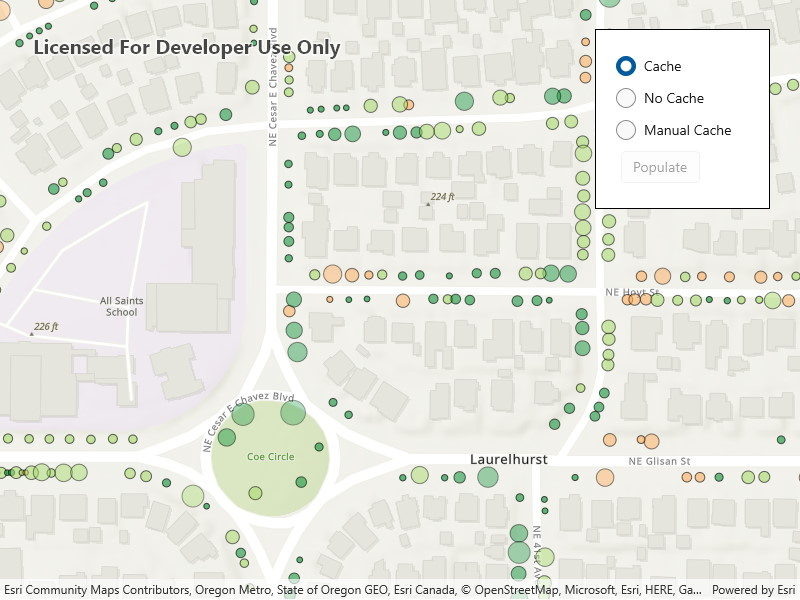

# Toggle between feature request modes

Use different feature request modes to populate the map from a service feature table.

## Use case

`ServiceFeatureTable` supports three request modes, which define how features are requested from the service and stored in the local table. The feature request modes have different performance characteristics. Use **On interaction cache** in scenarios with large amounts of infrequently edited data. Use **manual cache** in scenarios where you want to explicitly control requests for features. Use **no cache** in scenarios where you always want the freshest data. 

## How to use the sample

Run the sample and use the radio buttons to change what feature request modes you want to use (the default value is  **on interaction cache**). After you selected which feature request mode to use, click the `Populate` button to apply the feature request mode. 

## How it works

1. Create a `ServiceFeatureTable` with the a feature service URL.
2. Set the `FeatureRequestMode` property of the service feature table to the desired mode (`OnInteractionCache`, `OnInteractionNoCache`, or `ManualCache`).
    * If using `ManualCache`, populate the features with `ServiceFeatureTable.PopulateFromServiceAsync()`.
3. Create a `FeatureLayer` with the feature table and add it to an `MapView.Map`'s operational layers to display it.

## Relevant API

* FeatureLayer
* FeatureRequestMode.ManualCache
* FeatureRequestMode.NoCache
* FeatureRequestMode.OnInteractionCache
* ServiceFeatureTable
* ServiceFeatureTable.FeatureRequestMode
* ServiceFeatureTable.PopulateFromServiceAsync

## About the data

This sample uses the [Trees of Portland](https://services2.arcgis.com/ZQgQTuoyBrtmoGdP/arcgis/rest/services/Trees_of_Portland/FeatureServer/0) service showcasing over 200,000 street trees in Portland, OR. Each tree point models the health of the tree (green - better, red - worse) as well as the diameter of its trunk.

## Additional information

**On interaction cache** is the default feature request mode. Features are requested automatically for the visible extent as the users pans and zooms the map. If the user returns to an area where features have previously been requested, those features won't be requested again. In **no cache** mode, features are automatically populated from the service for the visible extent. Each time the user pans and zooms, features are downloaded for the visible extent. Features are still cached in a local geodatabase for display, but the cache will always be populated with the latest data after navigation. In **manual cache** mode, features are never automatically populated from the service. All features are loaded manually using calls to `PopulateFromServiceAsync`.

## Tags

cache, feature request mode, performance