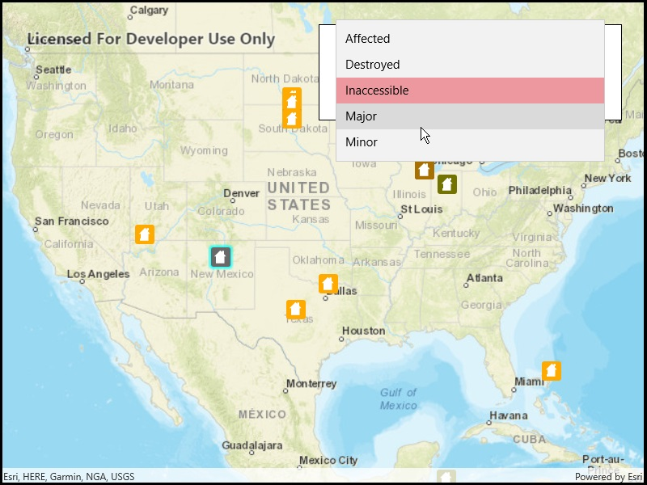

# Update attributes (feature service)

Update feature attributes in an online feature service.

## Use case

Online feature services can be updated with new data. This is useful for updating existing data in real time while working in the field.

## How to use the sample

To change the feature's damage property, tap the feature to select it, and update the damage type using the drop down.

## How it works

1. Create a `ServiceGeodatbase` object from a URL.
    * When the table loads, you can get the domain to determine which options to present in your UI.
2. Get a `ServiceFeatureTable` object from the `ServiceGeodatabase`.
3. Create a `FeatureLayer` object from the `ServiceFeatureTable`.
4. Select features from the `FeatureLayer`.
5. To update the feature's attribute, first load it, then use the `SetAttributeValue`.
6. Update the table with `UpdateFeatureAsync`.
7. After a change, apply the changes on the server using `ApplyEditsAsync`.

## Relevant API

* ArcGISFeature
* FeatureLayer
* ServiceFeatureTable
* ServiceGeodatabase

## Additional Information

When editing feature tables that are subject to database behavior (operations on one table affecting another table), it's now recommended to call these methods (apply edits & undo edits) on the `ServiceGeodatabase` object rather than on the `ServiceFeatureTable` object. Using the `ServiceGeodatabase` object to call these methods will prevent possible data inconsistencies and ensure transactional integrity so that all changes can be commited or rolled back. 

## Tags

amend, attribute, details, edit, editing, information, value