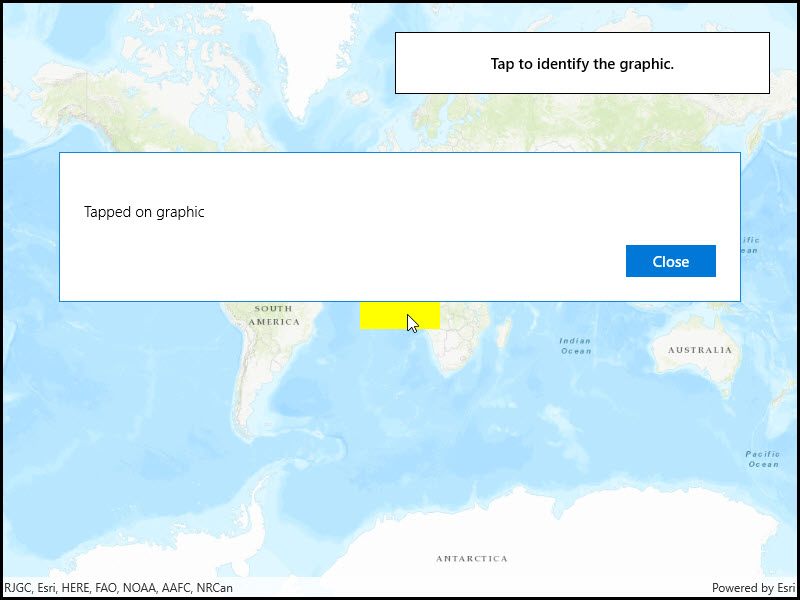

# Identify graphics

Display an alert message when a graphic is clicked.

## Use case

A user may wish to select a graphic on a map to view relevant information about it.

## How to use the sample

Select a graphic to identify it. You will see an alert message displayed.

## How it works

1. Create a `GraphicsOverlay` and add it to the `MapView`.
2. Add a `Graphic` along with a `SimpleFillSymbol` to the graphics overlay.
3. Create a `Point` from the location clicked on the map view by the user.
4. Identify the graphic on the map view with `IdentifyGraphicsOverlayAsync(graphicsOverlay, pointClicked, tolerance, max results)`.

## Relevant API

* Graphic
* GraphicsOverlay
* MapView

## Tags

graphics, identify