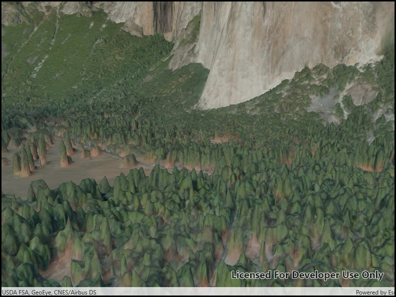

# Add integrated mesh layer

View an integrated mesh layer from a scene service.

## Use case

An integrated mesh is used to generate a mesh over a point dataset. They are most often used on high-density point datasets to create a high-resolution seamless surface.

## How to use the sample

After launching the sample, watch the integrated mesh layer load in place. Navigate around the scene to visualize the high level of detail on the buildings.

## How it works

1. Create a `Scene`.
2. Create an `IntegratedMeshLayer` with the URL to an integrated mesh layer scene service.
3. Add the layer to the scene's operational layers.
4. Create an `Camera` object and set it as the viewpoint camera of the scene view.

## Relevant API

* IntegratedMeshLayer

## About the data

This integrated mesh depicts the city of Girona, Spain and is attributed to the Institut Cartogràfic i Geològic de Catalunya (ICGC). The data was produced from [photogrammetrically correct imagery](https://pro.arcgis.com/en/pro-app/help/data/imagery/ortho-mapping-in-arcgis-pro.htm). Areas of white space within the integrated mesh are areas that had poor overlapping coverage from photos.

## Additional information

An integrated mesh layer can also be added to a scene from a local data source - either from a scene layer package (.slpk) or a mobile scene package (.mspk).

## Tags

3D, integrated mesh, layers
