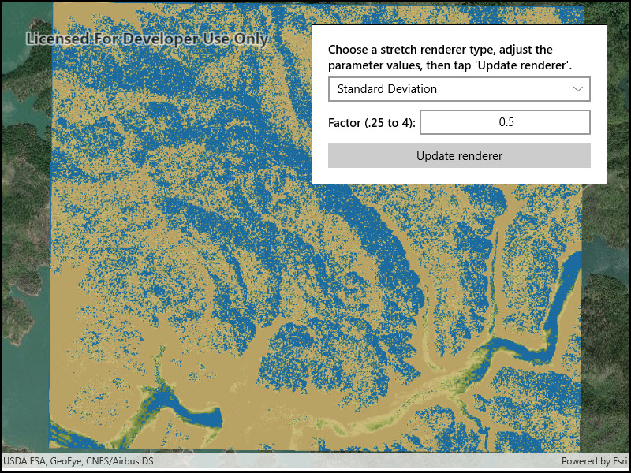

# Stretch renderer

Use a stretch renderer to enhance the visual contrast of raster data for analysis.

## Use case

An appropriate stretch renderer can enhance the contrast of raster imagery, allowing the user to control how their data is displayed for efficient imagery analysis.

## How to use the sample

Choose one of the stretch parameter types:

* Standard deviation - a linear stretch defined by the standard deviation of the pixel values
* Min-max - a linear stretch based on minimum and maximum pixel values
* Percent clip - a linear stretch between the defined percent clip minimum and percent clip maximum pixel values

Then configure the parameters and click 'Update renderer'.

## How it works

1. Create a `Raster` from a raster file.
2. Create a `RasterLayer` from the `Raster`.
3. Add the layer to the map.
4. Create a `StretchRenderer`, specifying the stretch parameters and other properties.
5. Apply the `Renderer` to the raster layer.

## Relevant API

* ColorRamp
* MinMaxStretchParameters
* PercentClipStretchParameters
* Raster
* RasterLayer
* StandardDeviationStretchParameters
* StretchParameters
* StretchRenderer

## Offline data

This sample downloads the following items from ArcGIS Online automatically:

* [raster-file.zip](https://www.arcgis.com/home/item.html?id=7c4c679ab06a4df19dc497f577f111bd) - Tif raster file

## About the data

This sample uses a raster imagery tile of an area of forested mountainous terrain and rivers.

## Additional information

See [Stretch function](http://desktop.arcgis.com/en/arcmap/latest/manage-data/raster-and-images/stretch-function.htm) in the *ArcMap* documentation for more information about the types of stretches that can be performed.

## Tags

analysis, deviation, histogram, imagery, interpretation, min-max, percent clip, pixel, raster, stretch, symbology, visualization