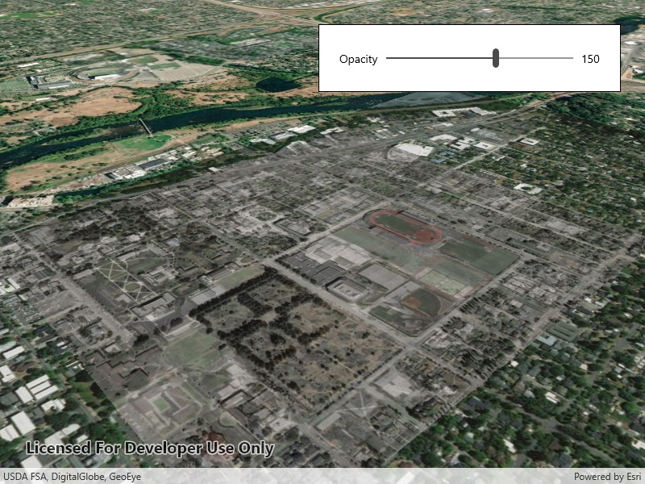

# Edit KML ground overlay

Edit the values of a KML ground overlay.

## Use case

KML ground overlays are used for showing aerial imagery, symbology, or other images draped over a scene. Changing the geometry, rotation, and other attributes of a ground overlay after it has been loaded allows for live editing.  For example, editing the geometry and opacity of a historical image draped over present day satellite imagery makes it possible to view change over time.

## How to use the sample

Use the slider to adjust the opacity of the ground overlay.

## How it works

1. Create an `Envelope` defining the geometry of the overlay.
2. Create a `KmlIcon` using a `Uri` linking to an image.
3. Create a `KmlGroundOverlay` using the envelope and icon.
4. Set the value of`KmlGroundOverlay.Rotation`.
5. Create a `KmlDataset` using the ground overlay.
6. Create a `KmlLayer` using the dataset.
7. Add the KML layer to the scene.
8. Listen for changes to the opacity slider and change the `KmlGroundOverlay.Color` value appropriately.

## Relevant API

* KmlDataset
* KmlGroundOverlay
* KmlIcon
* KmlLayer

## Offline data

This sample uses an .jpg image downloaded from [ArcGIS Online](https://arcgisruntime.maps.arcgis.com/home/item.html?id=1f3677c24b2c446e96eaf1099292e83e).

## About the data

The image used in this sample is an [aerial view of the campus of the University of Oregon](https://libapps.s3.amazonaws.com/accounts/55937/images/1944.jpg). This imagery was taken in 1944 by the U.S. Army Corps of Engineers. It is publicly available as [Online Aerial Imagery](https://researchguides.uoregon.edu/online-aerial-photography) hosted by Oregon University Library. It is also available as a Portal item on ArcGIS Online as [University of Oregon Campus Aerial Imagery - 1944](https://arcgisruntime.maps.arcgis.com/home/item.html?id=1f3677c24b2c446e96eaf1099292e83e).

## Tags

imagery, Keyhole, KML, KMZ, OGC