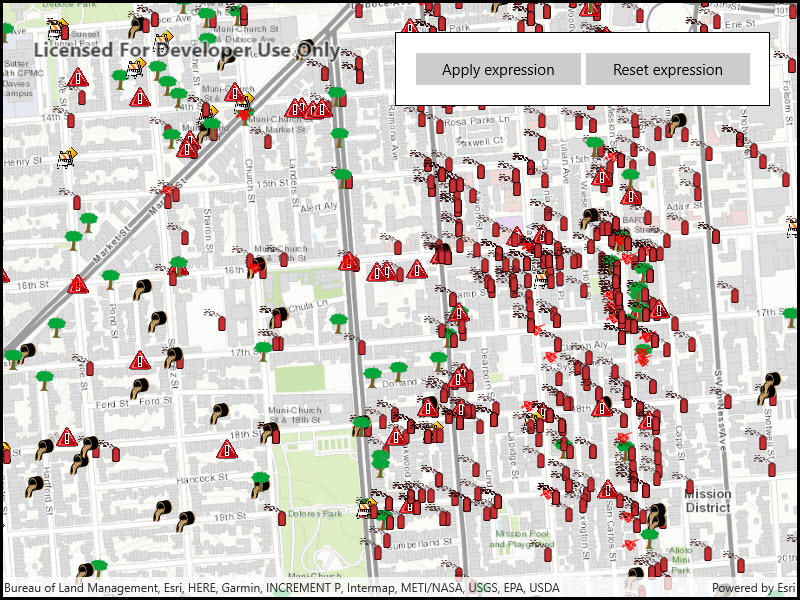

# Filter by definition expression or display filter

Filter features displayed on a map using a definition expression or a display filter.

## Use case

Definition queries allow you to define a subset of features to work with in a layer by filtering which features are retrieved from the dataset by the layer. This means that a definition query affects not only drawing, but also which features appear in the layer's attribute table and therefore which features can be selected, labeled, identified, and processed by geoprocessing tools.

Alternatively, display filters limit which features are drawn, but retain all features in queries and when processing. Definition queries and display filters can be used together on a layer, but definition queries limit the features available in the layer, while display filters only limit which features are displayed.

In this sample you can filter a dataset of tree quality selecting for only those trees which require maintenance or are damaged.

## How to use the sample

Use a definition expression to limit the features requested from the feature layer to those specified by a SQL query. This narrows down the results that are drawn, and removes those features from the layer's attribute table. To filter the results being drawn without modifying the attribute table, hit the button to apply the display filter instead.

The feature count value shows the current number of features in the current map view extent. When a definition expression is applied to narrow down the list of features being drawn, the count is updated to reflect this change. However if a display filter is applied, the features which are not visible on the map will still be included in the total feature count.

## How it works

1. Create a service feature table from a URL.
2. Create a feature layer from the service feature table.
3. Filter features on your feature layer using a `DefinitionExpression` to view a subset of features and modify the attribute table.
4. Filter features on your feature layer using a `DisplayFilter` to view a subset of features without modifying the attribute table.

## Relevant API

* DefinitionExpression
* FeatureLayer
* ServiceFeatureTable

## About the data

The [San Francisco 311 incidents layer](https://services2.arcgis.com/ZQgQTuoyBrtmoGdP/arcgis/rest/services/SF_311_Incidents/FeatureServer/0) in this sample displays point features related to crime incidents such as grafitti and tree damage that have been reported by city residents.

## Tags

definition expression, display filter, filter, limit data, query, restrict data, SQL, where clause
