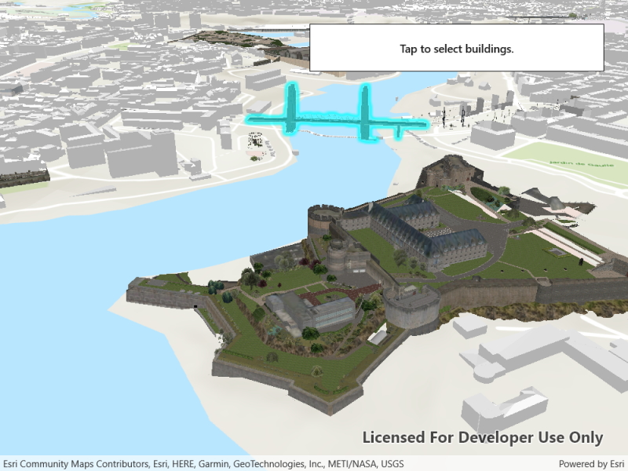

# Scene layer selection

Identify features in a scene to select.

## Use case

You can select features to visually distinguish them with a selection color or highlighting. This can be useful to demonstrate the physical extent or associated attributes of a feature, or to initiate another action such as centering that feature in the scene view.

## How to use the sample

Click on a building in the scene layer to select it. Deselect buildings by clicking away from the buildings.

## How it works

1. Create an `ArcGISSceneLayer` passing in the URL to a scene layer service.
2. Wait for the user to tap with the `sceneView.GeoViewTapped` event and get the tapped screen point.
3. Call `sceneView.IdentifyLayersAsync(sceneLayer, screenPoint, tolerance, false, 1)` to identify features in the scene.
4. From the resulting `IdentifyLayerResult`, get the list of identified `GeoElements` with `result.GeoElements`.
5. Get the first element in the list, checking that it is a feature, and call `sceneLayer.SelectFeature(feature)` to select it.

## Relevant API

* ArcGISSceneLayer
* Scene
* SceneView

## About the data

This sample shows a [Brest, France Scene](https://www.arcgis.com/home/item.html?id=ae142fec36b64f01b9d7871c8f694bbf) hosted on ArcGIS Online.

## Tags

3D, Brest, buildings, identify, model, query, search, select