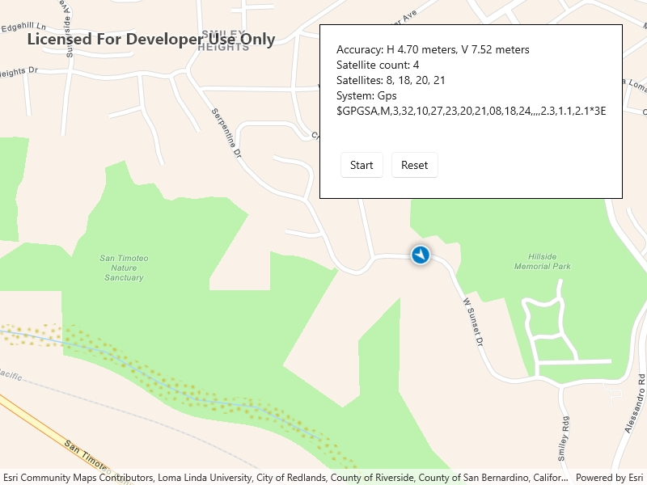

# Display device location with NMEA data sources

This sample demonstrates how to parse NMEA sentences and use the results to show device location on the map.

## Use case

NMEA sentences can be retrieved from GPS receivers and parsed into a series of coordinates with additional information. Devices without a built-in GPS receiver can retrieve NMEA sentences by using a separate GPS dongle, commonly connected bluetooth or through a serial port.

The NMEA location data source allows for detailed interrogation of the information coming from the GPS receiver. For example, allowing you to report the number of satellites in view.

## How to use the sample

Tap "Start" to parse the NMEA sentences into a simulated location data source, and initiate the location display. Tap "Reset" to reset the location display.

## How it works

1. Load NMEA sentences from a local file.
2. Parse the NMEA sentence strings, and push data into `NmeaLocationDataSource`.
3. Set the `NmeaLocationDataSource` to the location display's data source.
4. Start the location display to begin receiving location and satellite updates.

## Relevant API

* LocationDisplay
* NmeaLocationDataSource

## About the data

This sample reads lines from a local file to simulate the feed of data into the `NmeaLocationDataSource`. This simulated data source provides NMEA data periodically, and allows the sample to be used on devices without a GPS dongle that produces NMEA data.

The route taken in this sample features a [one minute driving trip around Redlands, CA](https://arcgis.com/home/item.html?id=d5bad9f4fee9483791e405880fb466da).

## Tags

GPS, history, navigation, NMEA, real-time, trace
