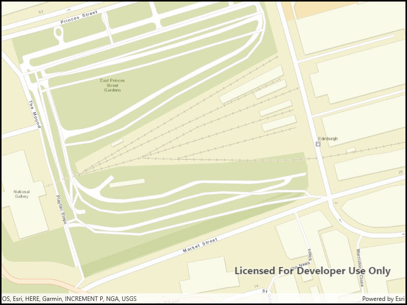

# Set min & max scale

Restrict zooming between specific scale ranges.

## Use case

Data may only appear at a certain scale on a map, and may be visually lost if zooming too far in or out. Setting the minimum and maximum scales ensures the zoom extents are appropriately limited for the purposes of the map.

## How to use the sample

Zoom in and out of the map. The zoom extents of the map are limited between the given minimum and maximum scales.

## How it works

1. Instantiate an `Map` object.
2. Set min and max scales of map with the `MinScale` and `MaxScale` properties.
3. Display the map in a map view.

## Relevant API

* Basemap
* Map
* MapView
* ViewPoint

## Tags

area of interest, level of detail, maximum, minimum, scale, viewpoint
