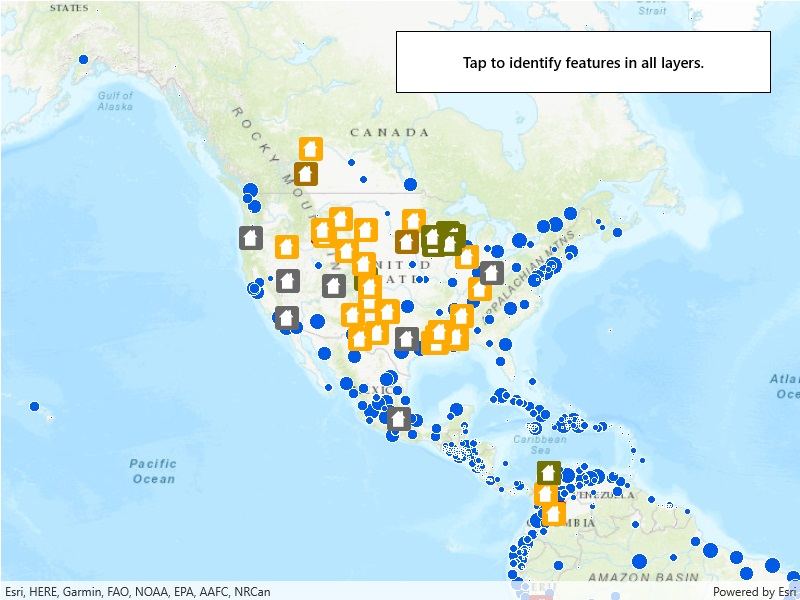

# Identify layers

Identify features in all layers in a map. MapView supports identifying features across multiple layers. Because some layer types have sublayers, the sample recursively counts results for sublayers within each layer.

## How to use the sample

Tap to identify features. An alert will show all layers with features under the cursor.

## How it works

1. The tapped position is passed to `MapView.IdentifyLayersAsync`
2. For each `IdentifyLayerResult` in the results, features are counted. 
    * Note: there is one identify result per layer with matching features; if the feature count is 0, that means a sublayer contains the matching features.

## Relevant API

* `IdentifyLayerResult`
* `MapView.IdentifyLayersAsync`
* `IdentifyLayerResult.LayerContent.Name`
* `IdentifyLayerResult.SublayerResults`

## Tags

identify, sublayers, recursive, recursion