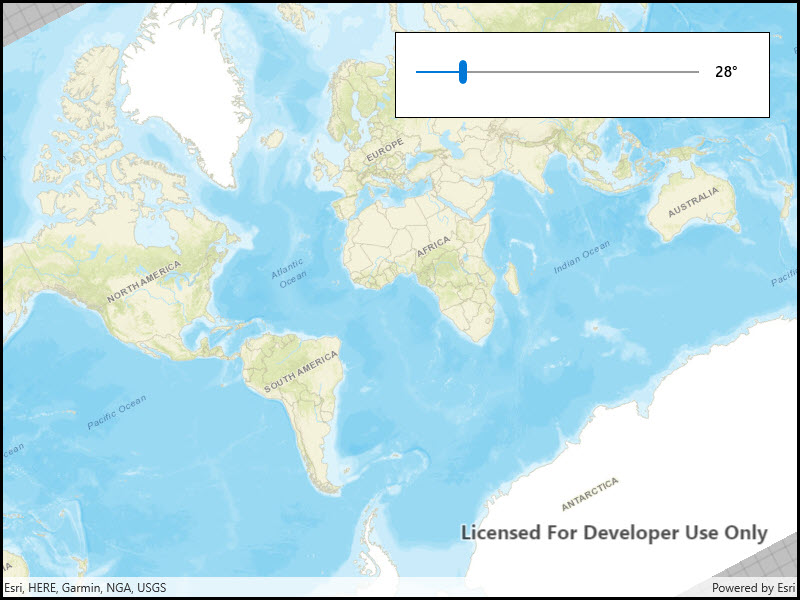

# Map rotation

Rotate a map.

## Use case

A user may wish to view the map in an orientation other than north-facing.

## How to use the sample

Use the slider to rotate the map.

## How it works

1. Instantiate an `Map` object.
2. Set the map in the `MapView` object.
3. Use `SetViewpointRotationAsync` to indicate the rotation angle.

## Relevant API

* Compass
* Map
* MapView

## Tags

rotate, rotation, viewpoint
