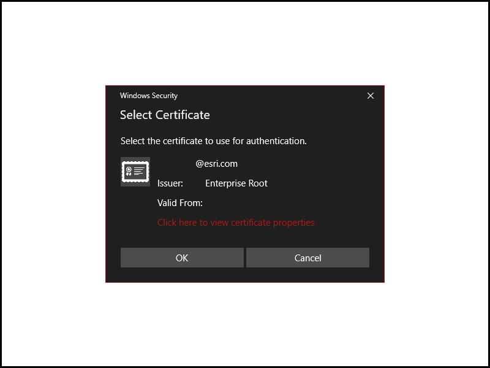

# Certificate authentication with PKI

Access secured portals using a certificate.

## Use case

PKI (Public Key Infrastructure) is a certificate authentication method to secure resources without requiring users to remember passwords. Government agencies commonly issue smart cards using PKI to access computer systems.

## How to use the sample

> **NOTE**: You must provide your own ArcGIS Portal with PKI authentication configured.

Provide a URL to a PKI-enabled server, then use the certificate selection UI to select an appropriate certificate for that server.

## How it works

1. Create the X.509 certificate store, referring to the user's certificates.
2. Open the certificate store in read-only mode.
3. Find all certificates that are currently valid.
4. Display the Windows certificate selection UI to choose from the returned certificates.
5. Create the credential with the chosen certificate.
6. Create the Portal, explicitly passing in the credential that was created.

## Relevant API

* CertificateCredential

## Additional information

ArcGIS Enterprise requires special configuration to enable support for PKI. See [Using Windows Active Directory and PKI to secure access to your portal](https://enterprise.arcgis.com/en/portal/latest/administer/windows/using-windows-active-directory-and-pki-to-secure-access-to-your-portal.htm) and [Use LDAP and PKI to secure access to your portal](https://enterprise.arcgis.com/en/portal/latest/administer/windows/use-ldap-and-pki-to-secure-access-to-your-portal.htm) in *Portal for ArcGIS*.

## Tags

authentication, certificate, login, passwordless, PKI, smartcard, store, X509
