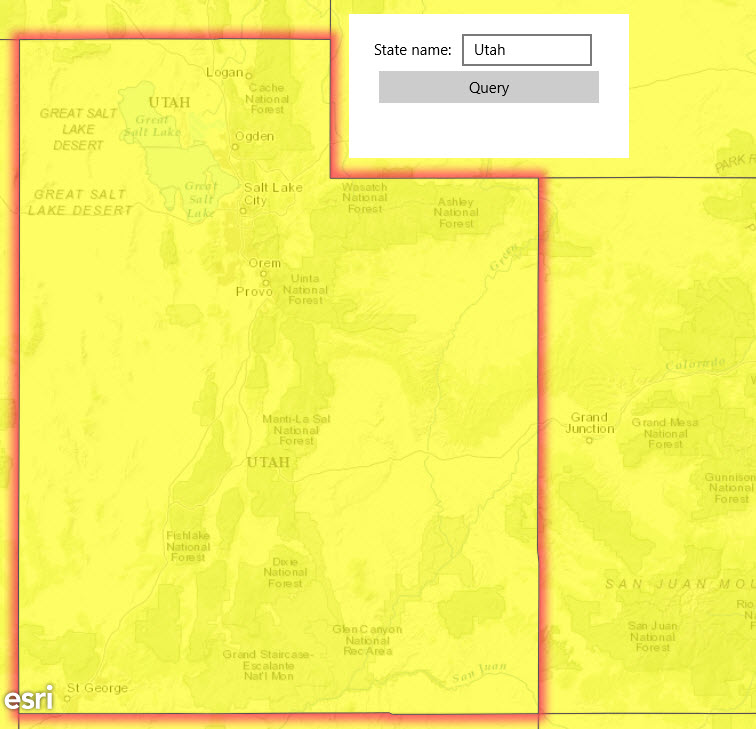

#Feature layer query

This sample demonstrates how to return features from a feature layer using an attribute query on the underlying feature table.

### Instructions
The sample provides a panel with two controls: a text box where you can input the name of a US State, and a button that executes an attribute query using that value. A successful query will select (highlight) the state and zoom the map to its extent.

