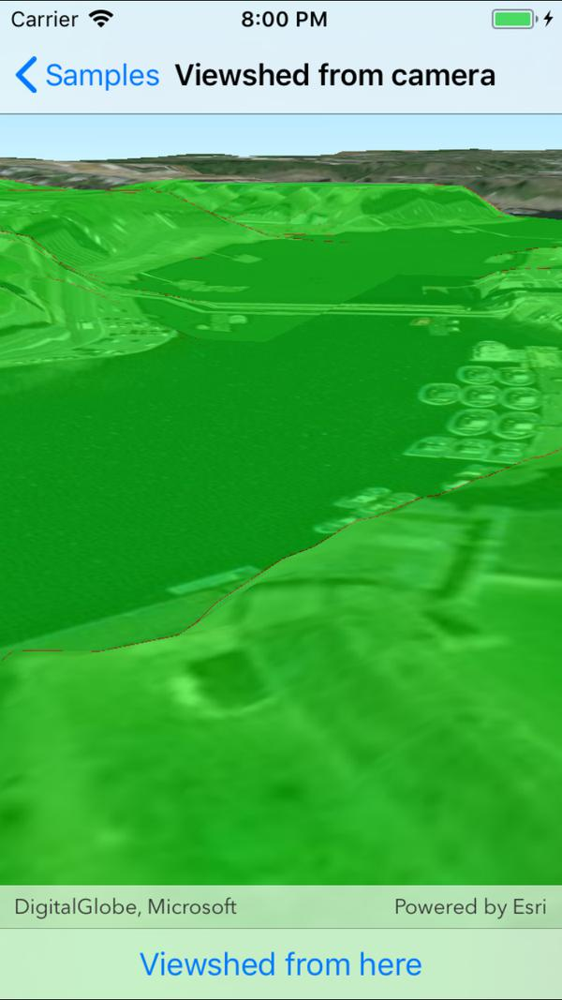

# Viewshed for camera

Analyze the viewshed for a camera. A viewshed shows the visible and obstructed areas from an observer's vantage point. 

## Use case

A viewshed analysis is a type of visual analysis you can perform on a scene. The viewshed aims to answer the question 'What can I see from a given location?'. The output is an overlay with two different colors - one representing the visible areas (green) and the other representing the obstructed areas (red).

## How to use the sample

The sample will start with a viewshed created from the initial camera location, so only the visible (green) portion of the viewshed will be visible. Move around the scene to see the obstructed (red) portions. Tap the button to update the viewshed to the current camera position.

## How it works

1. Create a `LocationViewshed`, passing in a `Camera` and a min/max distance.
2. Update the viewshed using `viewshed.UpdateFromCamera()`.

## Relevant API

* AnalysisOverlay
* Scene
* ArcGISSceneLayer
* ArcGISTiledElevationSource
* Camera
* LocationViewshed
* SceneView

## About the data

The scene shows a [buildings layer in Brest, France](https://tiles.arcgis.com/tiles/P3ePLMYs2RVChkJx/arcgis/rest/services/Buildings_Brest/SceneServer/layers/0) with a [local elevation source image service](https://scene.arcgis.com/arcgis/rest/services/BREST_DTM_1M/ImageServer) both hosted on ArcGIS Online.

## Tags

3D, Scene, viewshed, visibility analysis
