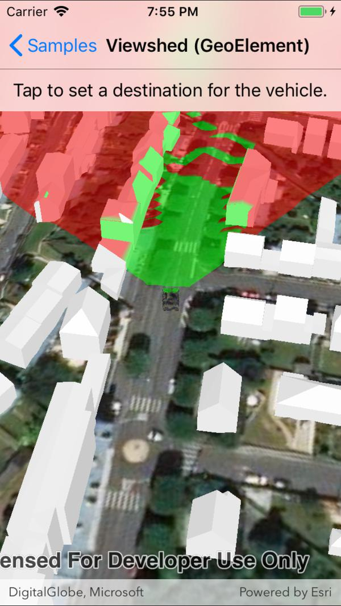

# Viewshed (GeoElement)
Analyze the viewshed for a GeoElement in a scene.

## How to use the sample
Tap to set a destination for the vehicle. The vehicle will 'drive' towards the tapped location. The viewshed analysis will update as the tank moves.

## How it works
1. Create and show the scene, with an elevation source and a buildings layer.
2. Add a model (the `GeoElement`) to represent the observer.
3. Create a `GeoElementViewshed` with configuration for the viewshed analysis.
4. Add the viewshed to an `AnalysisOverlay` and add the overlay to the scene.
5. Configure the SceneView `CameraController` to orbit the vehicle.

## About the data

This sample shows a [Johannesburg building layer](https://www.arcgis.com/home/item.html?id=eb4dab9e61b24fe2919a0e6f7905321e) from ArcGIS Online. The vehicle is a [tank](http://www.arcgis.com/home/item.html?id=07d62a792ab6496d9b772a24efea45d0).

## Relevant API
* `ModelSceneSymbol`
* `GeoElementViewshed`
* `AnalysisOverlay`
* `OrbitGeoElementCameraController`
* `GeodeticDistanceResult` & `GeometryEngine.DistanceGeodetic` - used to animate the vehicle.

## Tags
Buildings, scene, model, 3D