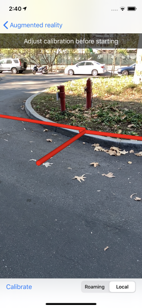

# View hidden infrastructure in AR

Visualize hidden infrastructure in its real-world location using augmented reality.

## Use case

You can use AR to 'x-ray' the ground to see pipes, wiring, or other infrastructure that isn't otherwise visible. You could use this feature to trace the flow of water through a building to help identify the source of a leak.

## How to use the sample

When you open the sample, you'll see a map centered on your current location. Use the tools to draw pipes around your location. An elevation surface will be queried to place the drawn infrastructure above or below ground. When you're ready, use the button to view the infrastructure you drew in AR.

There are two calibration modes in the sample: roaming and local. In roaming calibration mode, your position is updated automatically from the location data source every second. Because of that, you can only adjust heading, not position or elevation. This mode is best when working in a large area, where you would travel beyond the useful range of ARKit/ARCore.

When you're ready to take a more precise look at the infrastructure, switch to local calibration mode. In local calibration mode, you can make fine adjustments to location, altitude, and heading to ensure the content is exactly where it should be.

## How it works

1. See the 'Sketch on map' sample to learn how to use the sketch editor for creating graphics.
2. When you start the AR visualization experience, create and show the `ARSceneView`.
3. Access the `Scene` property of the AR View and set the space effect `SpaceEffect.None` and the atmosphere effect to `AtmosphereEffect.None`.
4. Create an elevation source and add it to the scene's base surface. Set the navigation constraint to `NavigationConstraint.None` to allow going underground if needed.
5. Configure a graphics overlay and renderer for showing the drawn pipes. This sample uses a `SolidStrokeSymbolLayer` with a `MultilayerPolylineSymbol` to draw the pipes as tubes. Add the drawn pipes to the overlay.
6. Configure the calibration experience.
    * When in roaming (continuous location update) mode, only heading calibration should be enabled. In continuous update mode, the user's calibration is overwritten by sensor-based values every second.
    * When in local mode, the user needs to be able to adjust the heading, altitude, and position; position adjustment is achieved by panning.
    * This sample uses a basemap as a reference during calibration; consider how you will support your user's calibration efforts. A basemap-oriented approach won't work indoors or in areas without readily visible, unchanging features like roads.

## Relevant API

* ARSceneView
* GraphicsOverlay
* MultilayerPolylineSymbol
* SketchEditor
* SolidStrokeSymbolLayer
* Surface

## About the data

This sample uses Esri's [world elevation service](https://elevation3d.arcgis.com/arcgis/rest/services/WorldElevation3D/Terrain3D/ImageServer) to ensure that the infrastructure you create is accurately placed beneath the ground.

Real-scale AR relies on having data in real-world locations near the user. It isn't practical to provide pre-made data like other Runtime samples, so you must draw your own nearby sample 'infrastructure' prior to starting the AR experience.

## Additional information

This sample requires a device that is compatible with ARKit 1 on iOS or ARCore 1.8 on Android.

Note that unlike other scene samples, a basemap isn't shown most of the time, because the real world provides the context. Only while calibrating is the basemap displayed at 50% opacity, to give the user a visual reference to compare to.

You may notice that pipes you draw underground appear to float more than you would expect. That floating is a normal result of the parallax effect that looks unnatural because you're not used to being able to see underground/obscured objects. Compare the behavior of underground pipes with equivalent pipes drawn above the surface - the behavior is the same, but probably feels more natural above ground because you see similar scenes day-to-day (e.g. utility wires).

**Real-scale AR** is one of three main patterns for working with geographic information in augmented reality. See  [Augmented reality](https://developers.arcgis.com/net/latest/ios/guide/display-scenes-in-augmented-reality.htm) in the guide for more information.

This sample uses a combination of two location data source modes: continuous update and one-time update, presented as 'roaming' and 'local' calibration modes in the app. The error in the position provided by ARKit/ARCore increases as you move further from the origin, resulting in a poor experience when you move more than a few meters away. The location provided by GPS is more useful over large areas, but not good enough for a convincing AR experience on a small scale. With this sample, you can use 'roaming' mode to maintain good enough accuracy for basic context while navigating a large area. When you want to see a more precise visualization, you can switch to 'local' (ARKit/ARCore-only) mode and manually calibrate for best results.

## Tags

augmented reality, full-scale, infrastructure, lines, mixed reality, pipes, real-scale, underground, visualization, visualize, world-scale