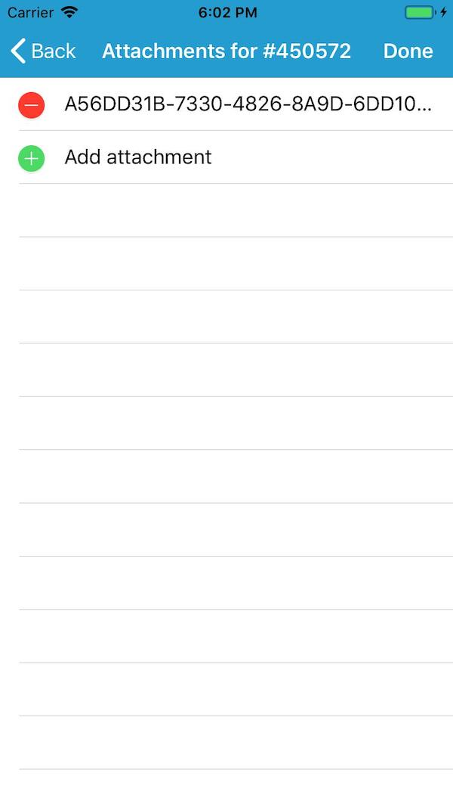

# Edit feature attachments

Add, delete, and download attachments for features from a service.

## How to use the sample

Tap a feature to load its attachments. Swipe to delete, select to preview, or tap 'Add attachment' to add a new attachment from your photo library.

## How it works

To get a `Feature` from a `ServiceFeatureTable` and add or delete `Attachment`:

1. Create a service feature table from a URL.
2. Create a `FeatureLayer` from the service feature table.
3. Select features from the feature layer, `FeatureLayer.SelectFeatures()`.
4. To fetch the feature's attachments, cast to an `ArcGISFeature` and use`ArcGISFeature.GetAttachmentsAsync()`.
5. To add an attachment to the selected ArcGISFeature, use `ArcGISFeature.AddAttachmentAsync()`.
6. To delete an attachment from the selected ArcGISFeature, use the `ArcGISFeature.DeleteAttachmentAsync()`.
7. After a change, apply the changes to the server using `ServiceFeatureTable.ApplyEditsAsync()`.

## Relevant API

* ServiceFeatureTable
* FeatureLayer
* GetAttachmentsAsync
* GetDataAsync
* DeleteAttachmentAsync
* UpdateFeatureAsync
* ApplyEditsAsync

## Tags

Edit and Manage Data