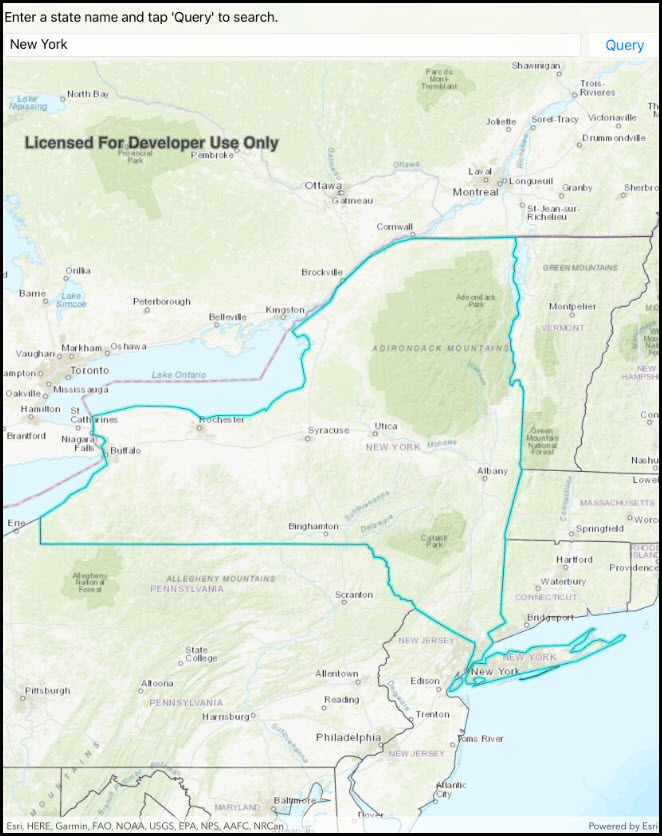

#Feature layer query

This sample demonstrates how to query a feature layer via feature table.

### Instructions

The sample provides a search bar on the top, where you can input the name of a US State. When you hit search the app performs a query on the feature table and based on the result either highlights the state geometry or provides an error.

