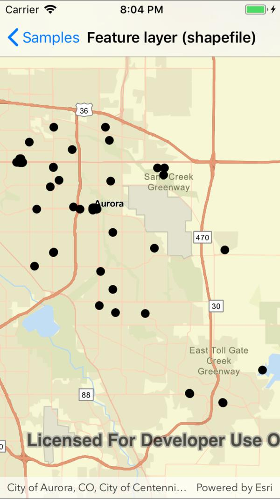

# Feature layer (shapefile)

This sample demonstrates how to open a shapefile stored on the device and display it as a feature layer with default symbology.

## Instructions

The shapefile will be downloaded from an ArcGIS Online portal automatically.
