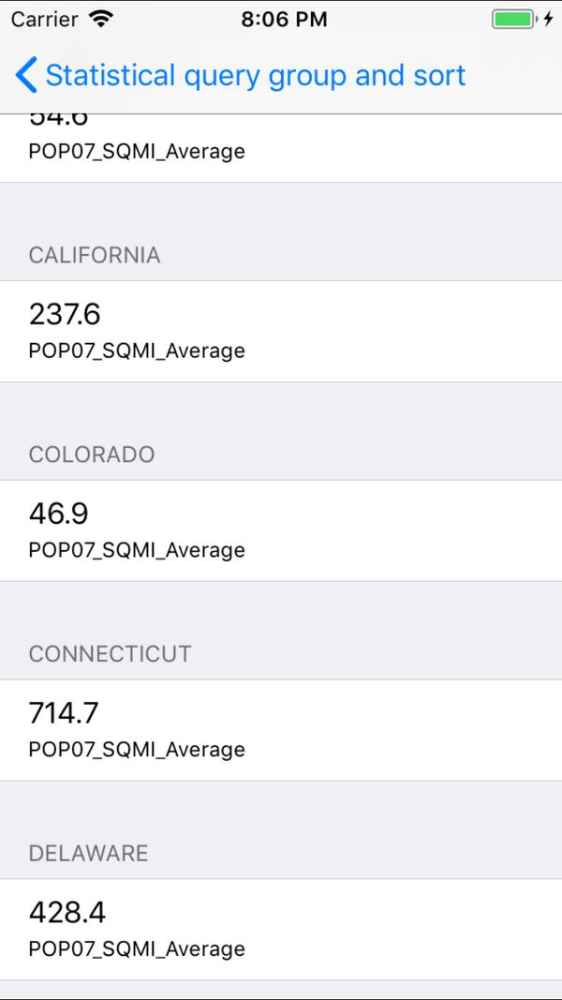

# Statistical query group and sort

Query a feature table for statistics, grouping and sorting by different fields.

## How to use the sample

Use the buttons to add statistic definitions, choose group-by fields, and choose order-by fields. When ready, click 'Get statistics'.

## How it works

1. Create a `ServiceFeatureTable` using the URL of a feature service and load the table.
2. Get the feature tables field names list with `featureTable.Fields`.
3. Create `StatisticDefinition`s specifying the field to compute statistics on and the `StatisticType` to compute.
4. Create `StatisticsQueryParameters` passing in the list of statistic definitions.
5. To have the results grouped by fields, add the field names to the query parameters' `GroupByFieldNames` collection.
6. To have the results ordered by fields, create `OrderBy`s, specifying the field name and `SortOrder`. Pass these `OrderBy`s to the parameters' `OrderByFields` collection.
7. To execute the query, call `featureTable.QueryStatisticsAsync(queryParameters)`.
8. Get the `StatisticQueryResult`. From this, you can get an iterator of `StatisticRecord`s to loop through and display.

## Relevant API

* Field
* QueryParameters
* ServiceFeatureTable
* StatisticDefinition
* StatisticRecord
* StatisticType
* StatisticsQueryParameters
* StatisticsQueryResult

## About the data

This sample uses a [Diabetes, Obesity, and Inactivity by US County](https://www.arcgis.com/home/item.html?id=392420848e634079bc7d0648586e818f) feature layer.

## Tags

group, result, sort, statistics, stats
