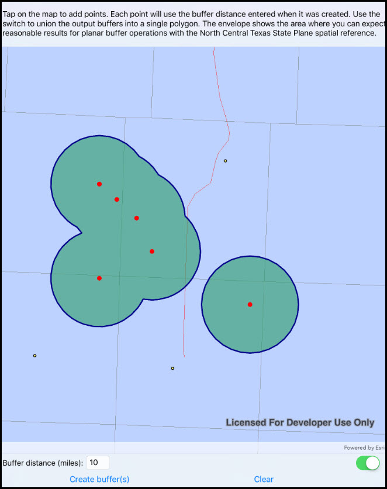

# Buffer list

This sample demonstrates how to use a planar (Euclidean) buffer operation by calling `GeometryEngine.Buffer` to generate one or more polygons from a collection of input geometries and a corresponding collection of buffer distances. The result polygons can be returned as individual geometries or unioned into a single polygon output.

## Instructions

Tap on the map to add points. Each point will use the buffer distance entered when it was created. The envelope shows the area where you can expect reasonable results for planar buffer operations with the North Central Texas State Plane spatial reference.
