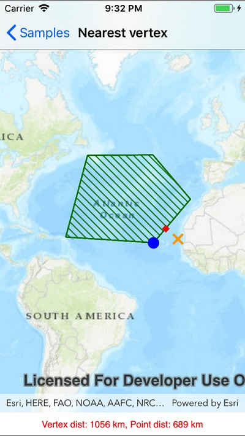

# Nearest vertex

This sample demonstrates how to use the Geometry engine find the nearest vertex and nearest coordinate of a polygon to a point. The distance for each is shown.

## Instructions

Tap on the map. The nearest point/coordinate and nearest vertex in the polygon will be shown.
