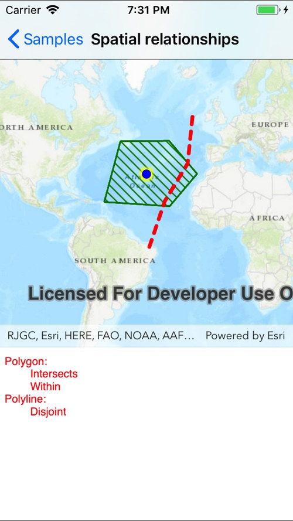

# Spatial relationships

This sample demonstrates how to use the GeometryEngine to evaluate the spatial relationships (for example, polygon a contains line b) between geometries.

## Instructions

Tap a graphic to select it. The display will update to show the relationships with the other graphics.
