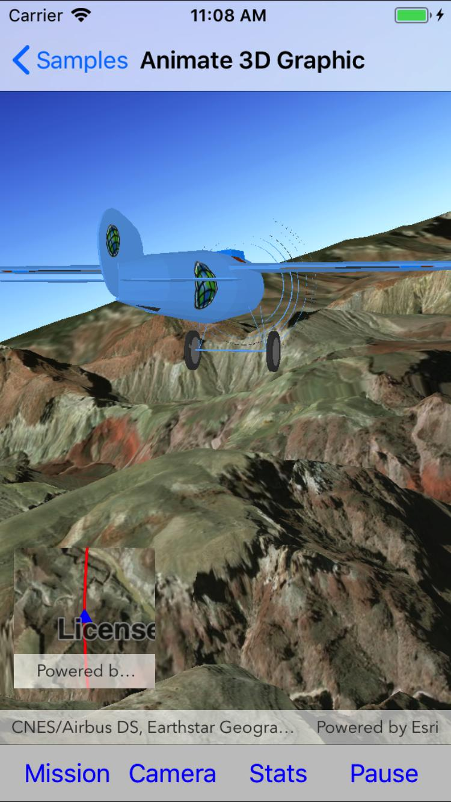

# Animate 3D Graphic

This sample demonstrates how to animate a graphic's position and follow it using a camera controller.

## Instructions

Click-and-drag to pan the sceneview, orbiting the moving plane. Click 'Camera' to toggle between the default and the orbiting camera controller.
The plane's route is shown on the inset map in the bottom left corner of the screen. Click 'Stats' to toggle stats display. Tap 'Mission' to choose from a list of alternative routes. 

Note that this is a graphics-intensive sample; performance may be degraded in certain situations (such as using a simulator).
