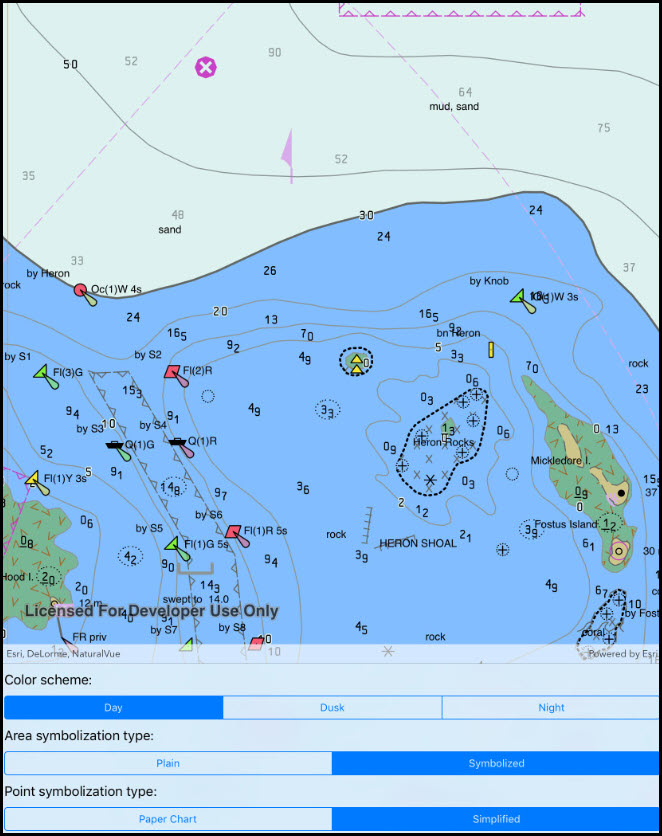

# Change ENC display settings

Configure the display of ENC content.

## Use case

The S-52 standard defines how Electronic Navigational Chart (ENC) content should be displayed to ensure that data is presented consistently across every charting system. S-52 defines several display options, including variations on symbology to ensure that charts are readable both at night and in direct sunlight.

## How to use the sample

The sample displays an electronic navigational chart when it opens. Use the options to choose variations on colors and symbology.

## How it works

1. Load the ENC exchange set.
2. Configure `EncEnvironmentSettings.Default.DisplaySettings` as specified by the user. The sample exposes options for color scheme, area symbolization, and point symbolization.
3. When the view unloads, call `ResetToDefaults` on the various display settings. Because the settings affect all ENCs displayed by Runtime, failing to reset them would affect other views.

## Relevant API

* EncAreaSymbolizationType
* EncAreaSymbolizationType.Plain
* EncAreaSymbolizationType.Symbolized
* EncColorScheme
* EncColorScheme.Day
* EncColorScheme.Dusk
* EncColorScheme.Night
* EncDisplaySettings
* EncDisplaySettings.MarinerSettings
* EncDisplaySettings.TextGroupVisibilitySettings
* EncDisplaySettings.ViewingGroupSettings
* EncEnvironmentSettings
* EncEnvironmentSettings.Default
* EncMarinerSettings.ResetToDefaults
* EncPointSymbolizationType
* EncPointSymbolizationType.PaperChart
* EncPointSymbolizationType.Simplified
* EncTextGroupVisibilitySettings.ResetToDefaults
* EncViewingGroupSettings.ResetToDefaults

## Offline data

This sample downloads the following items from ArcGIS Online automatically:

* [ExchangeSetwithoutUpdates.zip](https://www.arcgis.com/home/item.html?id=9d2987a825c646468b3ce7512fb76e2d) - Fake ENC content for use in ArcGIS Runtime samples.

## About the data

This sample uses an ENC exchange set designed for testing. It is available on [ArcGIS Online](https://www.arcgis.com/home/item.html?id=9d2987a825c646468b3ce7512fb76e2d).

## Tags

ENC, IHO, S-52, S-57, display, hydrographic, hydrography, layers, maritime, nautical chart, settings, symbology
