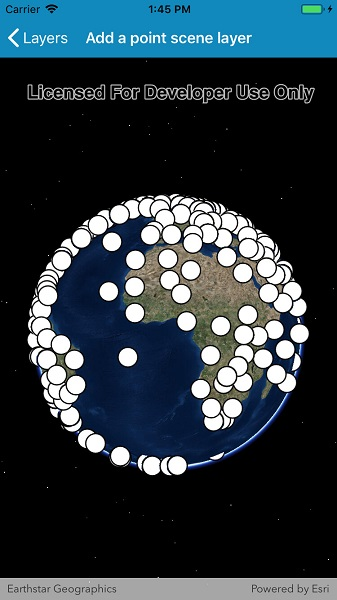

# Add a point scene layer

View a point scene layer from a scene service.

## Use case

Point scene layers can efficiently display large amounts of point features. While point cloud layers can only display simple symbols, point scene layer's can display any type of billboard symbol or even 3D models, as long as the location of the symbol can be described by a point. Points are cached and automatically thinned when zoomed out to improve performance.

## How to use the sample

Zoom in and pan around the scene. Notice how there are many thousands of features which are thinned when zoomed out.

## How it works

1. Create a scene.
2. Create an `ArcGISSceneLayer` with the URL to a point scene layer service.
3. Add the layer to the scene's operational layers collection.

## Relevant API

* ArcGISSceneLayer

## Tags

3D, point scene layer, layers