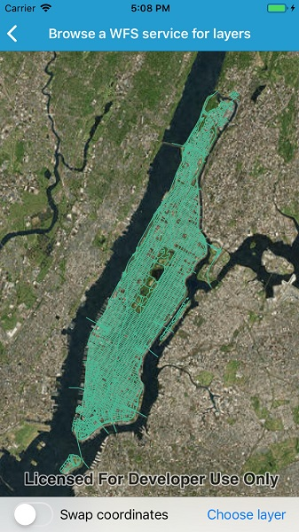

# Browse WFS layers

Browse a WFS service for layers.

## Use case

Many GIS scenarios involve accessing a service and discovering which layers should be displayed. For example, a feature service for a city might have layers representing roads, land masses, building footprints, parks, and facilities. A user may choose to only show the road network and parks for a park accessibility analysis.

## How to use the sample

Click 'Choose layer' to see a list of available layers and select one for display.

Some WFS services return coordinates in X,Y order, while others return coordinates in lat/long (Y,X) order. If you don't see features rendered or you see features in the wrong location, use the checkbox to change the coordinate order and reload.

## How it works

1. Create a `WfsService` object with a URL to a WFS feature service.
2. Obtain a list of `WfsLayerInfo` from `WfsService.ServiceInfo`.
3. When a layer is selected, create a `WfsFeatureTable` from the `WfsLayerInfo`.
    * Set the axis order if necessary.
4. Create a feature layer from the feature table.
5. Add the feature layer to the map.
    * The sample uses randomly generated symbology, similar to the behavior in ArcGIS Pro.

## Relevant API

* WfsService
* WfsServiceInfo
* WfsLayerInfo
* WfsFeatureTable
* FeatureLayer
* WfsFeatureTable.AxisOrder

## About the data

This service shows features for downtown Seattle. For additional information, see the underlying service on [ArcGIS Online](https://arcgisruntime.maps.arcgis.com/home/item.html?id=1b81d35c5b0942678140efc29bc25391).

## Tags

OGC, WFS, feature, web, service, layers, browse, catalog