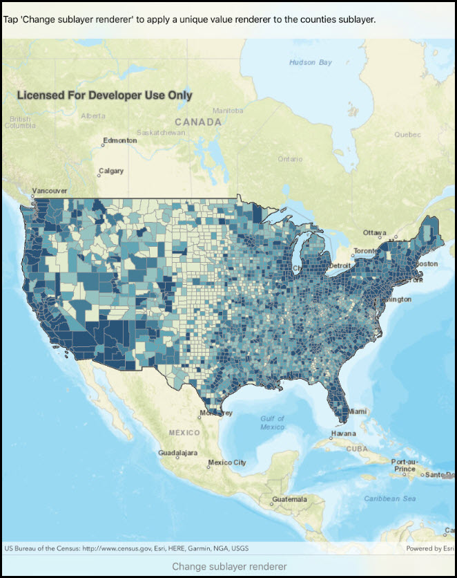

# Change sublayer renderer

This sample demonstrates how to change the sub-layer renderer of an ArcGIS map image layer. A unique value renderer is applied to see different population ranges in the counties sub-layer data.

## Instructions

Click the 'Change Sublayer Renderer' button to apply a unique value renderer to the counties sub-layer.
