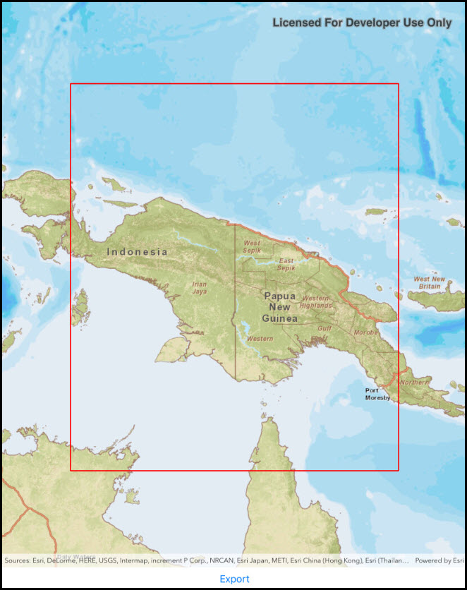

# Export tiles

Download tiles to a local tile cache file stored on the device.

## How to use the sample

Pan and zoom into the desired area, making sure the area is within the red block. Tap on the `Export tiles` button to start the process. On successful completion you will see a preview of the downloaded tpk.

## How it works

1. Create a `ExportTileCacheTask`.
2. Call `exportTask.CreateDefaultExportTileCacheParametersAsync(areaOfInterest, minScale, maxScale)` to generate default parameters.
3. Create a `ExportTileCacheJob`. Run the job.
4. Display the resulting tile cache in an `ArcGISTiledLayer`.

## Relevant API

* ExportTileCacheJob
* ExportTileCacheParameters
* ExportTileCacheTask
* TileCache

## Tags

Edit and Manage Data, cache, export, local, offline, package, tiles, tpk
