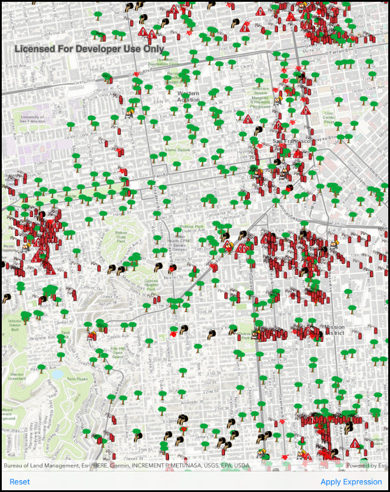

# Feature layer definition expression

Limit the features to display on the map using a definition expression.

## Use case

One use case includes improving application performance by restricting the amount of features returned from a feature service. The definition expression is applied to visualized features as well as the underlying feature table. Another use case is the data in a FeatureLayer may be sensitive and require a certain level of authorization/permission to view. By setting a definition expression to only those records specified the data is protected from unauthorized access.

## How to use the sample

Press the 'Apply Expression' button to limit the features requested from the feature layer to those specified by the SQL query definition expression. Click the 'Reset Expression' button to remove the definition expression on the feature layer, which returns all the records.

## How it works

1. Create a service feature table from a URL.
2. Create a feature layer from the service feature table.
3. Set the limit of the features on your feature layer using the `DefinitionExpression`.

## Relevant API

* DefinitionExpression
* FeatureLayer
* ServiceFeatureTable

## Tags

DefinitionExpression, ServiceFeatureTable, definition expression, filter, limit data, query, restrict data, sql where clause
