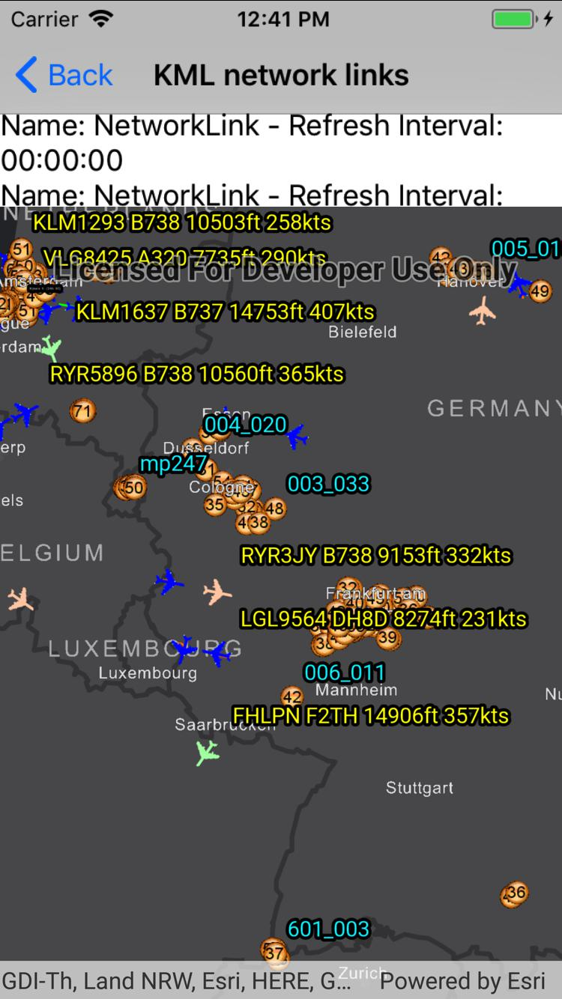

# KML network links

This sample demonstrates accessing a KML file with network links that automatically refresh temporal information. The name of the various network links and their refresh interval will also be displayed.

