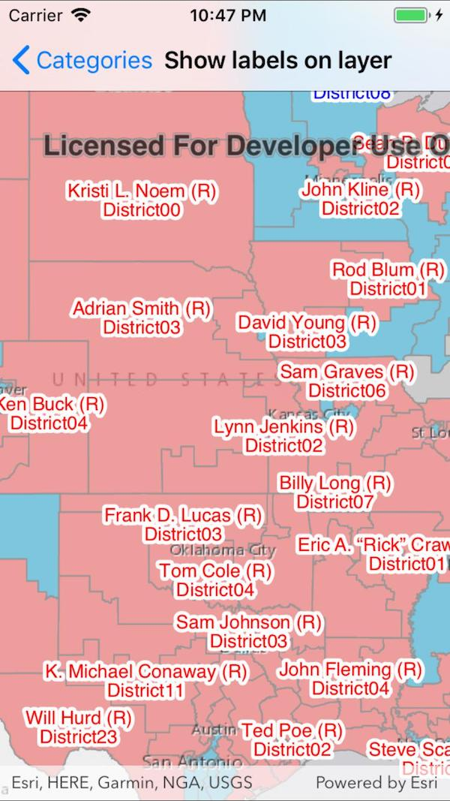

# Show labels on layers

Display custom labels on a feature layer.

## How to use the sample

Pan and zoom around the United States. Labels for congressional districts will be shown in red for Republican districts and blue for Democrat districts. Notice how labels pop into view as you zoom in.

## How it works

1. Create a `ServiceFeatureTable` using a feature service URL.
2. Create a `FeatureLayer` from the service feature table.
3. Create a `TextSymbol` to use for displaying the label text.
4. Create a JSON string for the label definition.
    * Set the "LabelExpressionInfo.expression" key to express what the text the label should display. You can use fields of the feature by using `$feature.field_name` in the expression.
    * To use the text symbol, set the "symbol" key to the symbol's JSON representation using `textSymbol.ToJson()`.
5. Create a label definition from the JSON using `LabelDefinition.FromJson(json)`.
6. Add the definition to the feature layer with `featureLayer.LabelDefinitions.Add(labelDefinition)` .
7. Lastly, enable labels on the layer using `featureLayer.LabelsEnabled`.

## Relevant API

* FeatureLayer
* LabelDefinition
* TextSymbol

## About the data

This sample uses the [USA 116th Congressional Districts](https://www.arcgis.com/home/item.html?id=cc6a869374434bee9fefad45e291b779) feature layer.

## Additional information

Help regarding the Json syntax for defining the LabelDefinition.FromJson syntax can be found in the [web map specification](https://developers.arcgis.com/web-map-specification/objects/labelingInfo/).

## Tags

Deconfliction, Labeling, Labels, visualization
