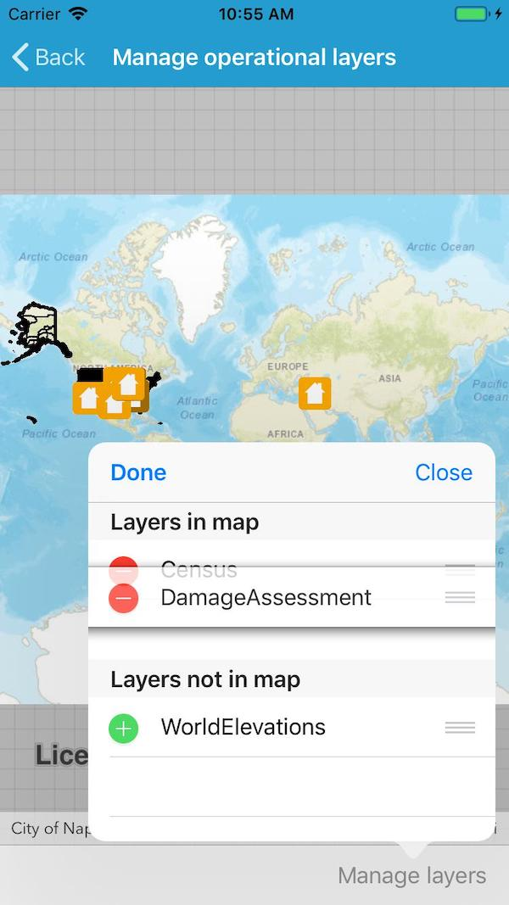

# Manage operational layers

Add, remove, and reorder operational layers in a map.

## How to use the sample

Tap 'Manage layers' to see a list of layers. Tap edit in the popup to see editing controls. Layers can be dragged (using the handle on the right of the list item) to reorder within lists or moved in/out of the map's operational layers.

## How it works

A map's `OperationalLayers` collection controls which layers are visualized. `MapView` automatically updates the visualization when the `Map` changes. A separate collection holds layers that have been removed from the operational layers. 

## Relevant API

* Map
* ArcGISMapImageLayer
* MapView
* MapView.OperationalLayers

## Tags

Map, scene, operational, hide, remove, add
