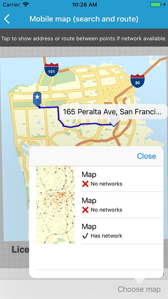

# Mobile map (search and route)

Display maps and use locators to enable search and routing offline using a Mobile Map Package.

## Use case

Mobile map packages make it easy to transmit and store the necessary components for an offline map experience, including transportation networks (for routing/navigation), locators (address search, forward and reverse geocoding), and maps. A field worker might download a mobile map package to support their operations while working outside the range of cell service.

## How to use the sample

Tap 'Choose map' to see a list of maps in the package. If a map contains transportation networks, the list item will have a check mark. Click on a map in the list to open it. Tap on the map to reverse geocode the tapped locations's address if a locator task is available. If transportation networks are available, a route will be calculated between tapped locations. Tap on the map again to clear the route result.

## How it works

1.  Create a `MobileMapPackage` using `MobileMapPackage.OpenAsync(path)`.
2. Get a list of maps using the `Maps` property.
3.  If the package has a locator, access it using the `LocatorTask` property.
4.  To see if a map contains transportation networks, check each map's `TransportationNetworks` property.

## Relevant API

* GeocodeResult
* MobileMapPackage
* ReverseGeocodeParameters
* Route
* RouteParameters
* RouteResult
* RouteTask
* TransportationNetworkDataset

## Tags

Offline, Routing, Search, geocode, network, transportation, network analysis, disconnected, field mobility